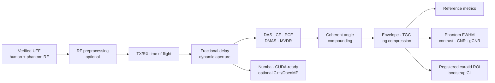

<div align="center">

# Ultrasound B-mode Lab

### Measured RF → beamforming research → physical phantom validation → accelerated B-mode

[](https://github.com/bekiroruk/ultrasound-bmode-lab/actions/workflows/ci.yml)
[](https://www.python.org/)
[](https://doi.org/10.5281/zenodo.20261898)
[](https://creativecommons.org/licenses/by/4.0/)
[](LICENSE)

An inspectable ultrasound image-formation laboratory built from first principles. It processes
public **in-vivo human carotid** and **physical CIRS phantom** RF channel measurements, compares
five beamformers, quantifies image quality, and accelerates conventional CPWC without changing
its numerical result.

> Research and educational software only. Not a medical device; not for diagnosis, treatment,
> patient monitoring, or clinical decision-making.

</div>

<p align="center">
  
</p>

## Evidence at a glance

| Item | Measured result |
|---|---:|
| Real acquisitions | In-vivo carotid + 2 physical CIRS phantom scans |
| Raw carotid tensor | 75 transmissions × 128 elements × 1,536 RF samples |
| Our 75-angle / UFF correlation | **0.815** |
| Our 75-angle / UFF SSIM | **0.462** |
| Our 75-angle / UFF RMSE | **8.07 dB** |
| Numba speedup, 75 angles | **21.8×** in the recorded run |
| Numba runtime, 75 angles | **2.229 s** on the measured host |
| Physical phantom median lateral FWHM | **0.599 mm** — our 11-angle CPWC |
| Physical phantom median axial FWHM | **0.679 mm** — our 11-angle CPWC |
| Automated tests | **30 passing** with local datasets and acceleration extra |

Runtimes are hardware-dependent single-host measurements. Image metrics compare normalized
display images and are research evidence, not clinical-performance claims.

## What the project implements



For pixel `(x, z)`, receive element `e`, and plane-wave angle `θ`, the conventional path uses

```text
t(x, z, e, θ) = [x sin(θ) + z cos(θ) + √((x − xₑ)² + z²)] / c
```

with `c = 1540 m/s`, linear fractional-delay interpolation, depth-dependent F-number aperture,
cosine apodization, and coherent transmission compounding.

### Reconstruction and adaptive methods

- conventional normalized delay-and-sum (DAS);
- coherence factor (CF) and phase coherence factor (PCF);
- signed square-root delay-multiply-and-sum (DMAS);
- diagonally loaded, spatially smoothed Capon/MVDR;
- configurable 1, 3, 11, 31, and 75-angle CPWC;
- NumPy reference, parallel Numba CPU, CUDA kernel, and optional C++/OpenMP source.

### Evaluation methods

- correlation, normalized dB RMSE, local SSIM, and PSNR;
- contrast, CNR, generalized CNR, and speckle SNR;
- axial/lateral −6 dB FWHM and nominal target-position error;
- phase-correlation registration, carotid wall sharpness, and 95% bootstrap intervals;
- runtime, FPS, process working set, backend agreement, and speedup.

## Angle-count study: quality versus compute

<p align="center">
  
</p>

| Angles | Correlation | RMSE [dB] | SSIM | PSNR [dB] |
|---:|---:|---:|---:|---:|
| 1 | 0.774 | 11.06 | 0.160 | 14.68 |
| 3 | 0.747 | 11.90 | 0.127 | 14.05 |
| 11 | 0.778 | 9.59 | 0.271 | 15.93 |
| 31 | 0.806 | 8.38 | 0.403 | 17.10 |
| 75 | **0.815** | **8.07** | **0.462** | **17.42** |

The non-monotonic 1→3 behavior is retained rather than hidden: the three-angle experiment uses
the two extreme steering angles plus 0°, while a single transmission uses the central 0° wave.
From 11 angles onward, structural similarity improves consistently.

<p align="center">
  
</p>

## Physical phantom validation

The project downloads measured contrast/speckle and resolution/distortion scans recorded on a
CIRS Multi-Purpose Ultrasound Phantom Model 040GSE. The same RF loader and CPWC code reconstruct
both datasets.

<p align="center">
  
</p>

| Metric | UFF 75-angle reference | Our 11-angle CPWC |
|---|---:|---:|
| Shallow cyst contrast | −28.53 dB | −14.76 dB |
| Shallow cyst gCNR | 0.976 | 0.838 |
| Deep cyst contrast | −23.30 dB | −3.07 dB |
| Speckle SNR | 1.869 | 1.749 |
| Median lateral FWHM | 0.675 mm | **0.599 mm** |
| Median axial FWHM | **0.574 mm** | 0.679 mm |

The deep-cyst loss exposes a genuine limitation of the current 11-angle baseline. It is reported
as a target for further algorithm tuning, not concealed by display processing.

## Adaptive beamformers and enhancement ablation

<p align="center">
  
</p>

The adaptive comparison uses identical measured channels, three transmissions, and a coarse grid
to keep MVDR covariance estimation tractable. In that controlled run, MVDR reached 0.784
correlation versus 0.704 for DAS, while CF/PCF strongly suppressed low-coherence regions. Method
outputs have different amplitude statistics, so no method is declared universally superior.

The [enhancement ablation](artifacts/enhancement/enhancement_ablation.png) separately evaluates
RF band-pass filtering, common-mode rejection, automatic TGC, adaptive display range, and
edge-preserving diffusion. RF preprocessing slightly improved correlation from 0.77813 to
0.77841. Strong TGC/despeckling reduced reference similarity and therefore remains optional.

## Acceleration

<p align="center">
  
</p>

| Angles | NumPy [s] | Numba [s] | Speedup | B-mode correlation |
|---:|---:|---:|---:|---:|
| 1 | 0.687 | 0.025 | 27.4× | 1.000000 |
| 11 | 7.195 | 0.221 | **32.5×** | 1.000000 |
| 75 | 48.626 | 2.229 | 21.8× | 1.000000 |

One-time JIT compilation (`3.895 s` in this run) is measured separately. A CUDA kernel and a
C++/OpenMP implementation are included as optional backends. This host had no CUDA device and no
built native library, so the report marks them unavailable rather than inventing runtimes.

## Registered carotid ROI with uncertainty

<p align="center">
  
</p>

The ROI is located on the reference inside a constrained carotid search window, then reused for
the registered reconstruction. The 75-angle result reported lumen contrast of −15.72 dB
(`95% CI −16.85 to −14.61 dB`) and gCNR 0.606 (`95% CI 0.544–0.648`). Pixel bootstrap intervals
measure within-ROI sampling variability; they do not represent population or clinical uncertainty.

## Reproduce the complete study

```bash
git clone https://github.com/bekiroruk/ultrasound-bmode-lab.git
cd ultrasound-bmode-lab

python -m venv .venv

# Windows
.venv\Scripts\activate

# Linux/macOS
source .venv/bin/activate

python -m pip install -e ".[dev,accelerated]"

python scripts/download_picmus.py --dataset carotid
python scripts/download_picmus.py --dataset contrast
python scripts/download_picmus.py --dataset resolution

ultrasound-real --output-dir artifacts/real_data --angles 11
ultrasound-benchmark --output-dir artifacts/benchmark
ultrasound-adaptive --output-dir artifacts/adaptive --angles 3 --stride 4
ultrasound-phantom --output-dir artifacts/phantom --angles 11
ultrasound-enhance --output-dir artifacts/enhancement --angles 11
ultrasound-accelerate --output-dir artifacts/acceleration
ultrasound-roi --output-dir artifacts/roi --angles 75

python -m unittest discover -s tests -v
```

The downloader retrieves immutable Zenodo files and validates their published byte sizes and MD5
values. Raw human and phantom RF remain ignored under `data/raw/`.

## Dataset provenance

All three measured datasets are distributed through the
[USTB public catalog](https://unioslo.github.io/USTB/datasets.html) and archived as
[Zenodo DOI 10.5281/zenodo.20261898](https://doi.org/10.5281/zenodo.20261898) under **CC BY 4.0**.

- `PICMUS_carotid_cross.uff`: in-vivo human carotid cross-section;
- `PICMUS_experiment_contrast_speckle.uff`: physical CIRS contrast/speckle phantom;
- `PICMUS_experiment_resolution_distortion.uff`: physical CIRS resolution/distortion phantom.

The UFF files describe 75 steered plane waves and a 128-element linear probe. Published examples
identify a Verasonics Vantage 256 research scanner and L11 probe. Numerical reconstruction values
are read from the files. See [real-data provenance](docs/real-data-provenance.md) and
[configuration traceability](docs/configuration-traceability.md).

### Required dataset citation

H. Liebgott, A. Rodriguez-Molares, F. Cervenansky, J. A. Jensen and O. Bernard,
“Plane-Wave Imaging Challenge in Medical Ultrasound,” *2016 IEEE International Ultrasonics
Symposium*, pp. 1–4, doi:
[10.1109/ULTSYM.2016.7728908](https://doi.org/10.1109/ULTSYM.2016.7728908).

## Verification and lifecycle evidence

- [Software requirements](docs/software-requirements.md)
- [Algorithm design](docs/algorithm-design.md)
- [Verification and traceability plan](docs/verification-plan.md)
- [Research risk-management record](docs/risk-management.md)
- [Configuration and data traceability](docs/configuration-traceability.md)
- [Medical-software lifecycle note](docs/medical-software-lifecycle-note.md)

These records borrow useful structure from medical-software engineering. They are not a claim of
IEC 62304, ISO 14971, ISO 13485, FDA, CE, UKCA, or other regulatory compliance.

## Repository structure

```text
ultrasound-bmode-lab/
├── src/ultrasound_bmode/
│   ├── real_data.py          # UFF loader and DAS/CPWC
│   ├── adaptive.py           # CF, PCF, DMAS, MVDR
│   ├── accelerated.py        # Numba CPU and CUDA kernels
│   ├── native_backend.py     # Optional C++ bridge
│   ├── processing.py         # Envelope, filtering, TGC, compression, diffusion
│   ├── phantom.py            # Contrast, speckle, FWHM and distortion metrics
│   ├── roi.py                # Registration and uncertainty-aware carotid ROI
│   └── *_cli.py              # Reproducible experiment commands
├── native/                   # Optional C++17/OpenMP DAS backend
├── scripts/                  # Verified PICMUS downloader
├── tests/                    # Synthetic, real-data, metric and backend tests
├── docs/                     # Provenance, requirements, risk and verification records
├── artifacts/                # Versioned figures and machine-readable results
└── .github/workflows/        # Python 3.10/3.12 CI
```

## Known limitations

- One public in-vivo subject and one acquisition platform cannot establish generalization.
- The UFF image is an algorithmic reference, not anatomical or diagnostic ground truth.
- Constant sound speed, linear interpolation, and simplified receive modelling remain.
- Deep phantom contrast is weak in the current 11-angle reconstruction.
- Adaptive methods need parameter studies on independent acquisitions.
- Bootstrap intervals ignore spatial correlation and between-subject variability.
- CUDA and C++ runtimes require corresponding local hardware/build tools and were unavailable on
  the measured host.

## License

Source code is released under the [MIT License](LICENSE). PICMUS/USTB data is not redistributed by
this repository and remains subject to its own CC BY 4.0 license and attribution requirements.
