<div align="center">

# Ultrasound B-mode Lab

### Measured RF → beamforming research → physical phantom validation → accelerated B-mode

[](https://github.com/bekiroruk/ultrasound-bmode-lab/actions/workflows/ci.yml)
[](https://www.python.org/)
[](https://doi.org/10.5281/zenodo.20261898)
[](https://creativecommons.org/licenses/by/4.0/)
[](LICENSE)

An inspectable ultrasound image-formation laboratory built from first principles. It processes
public **in-vivo human carotid** and **physical phantom** RF channel measurements from USTB and
EPFL, compares five beamformers, quantifies image quality, and accelerates conventional CPWC
without changing its numerical result.

> Research and educational software only. Not a medical device; not for diagnosis, treatment,
> patient monitoring, or clinical decision-making.

</div>

<p align="center">
  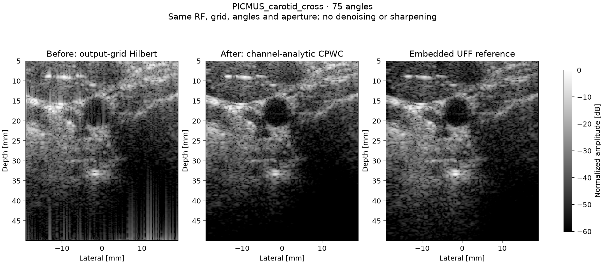
</p>

## Evidence at a glance

| Item | Measured result |
|---|---:|
| Real acquisitions | **4 human carotid + 3 physical phantom scans** |
| Independent EPFL volunteers | **2** — public volunteer IDs 005 and 008 |
| Probe/platform coverage | L11/L11-4v, GE 9L-D, and Alpinion L3-8 |
| Raw carotid tensor | 75 transmissions × 128 elements × 1,536 RF samples |
| Channel-analytic 75-angle carotid cross / UFF correlation | **0.928** |
| Channel-analytic 75-angle carotid cross / UFF SSIM | **0.731** (legacy: 0.462) |
| Channel-analytic 75-angle carotid cross / UFF RMSE | **4.84 dB** (legacy: 8.07 dB) |
| Channel-analytic embedded-reference validation | **2 human views + 2 physical phantom scans**, each at 11 and 75 angles |
| Channel-analytic external checks | **2 EPFL volunteers + 1 Alpinion phantom**, 11/full angles |
| Analytic Numba median runtime, 11 angles | **0.140 s** — 3 warm repeats, F/1.5 |
| Analytic Numba median runtime, 75 angles | **4.934 s** — 3 warm repeats, F/1.5 |
| Analytic Numba sampled RSS peak, 75 angles | **536.3 MiB** — whole process, separate memory pass |
| Analytic deep phantom cyst gCNR, 11 angles | **0.926** (legacy: 0.268) |
| Analytic phantom median lateral FWHM, 11 angles | **0.652 mm** (legacy: 0.599 mm; wider) |
| Analytic phantom median axial FWHM, 11 angles | **0.577 mm** (legacy: 0.679 mm; narrower) |
| Exploratory analytic lateral FWHM, F/0.8 | **0.572 mm** — 11 angles; defaults unchanged |
| Automated tests | **55 passing** with local datasets and acceleration extra |

Runtimes are hardware-dependent single-host measurements. Image metrics compare normalized
display images and are research evidence, not clinical-performance claims.

## v0.6: aperture tradeoffs and measured compute cost

The [receive-aperture study](artifacts/aperture_study/README.md) sweeps F/0.8, 1.0, 1.2,
1.5, 1.7, 2.0 and 2.5 at 11 and 75 angles on the two PICMUS physical phantom acquisitions.
Lower F-number opens a wider receive aperture. Selection uses only the 11-angle stride-2
results: minimize lateral FWHM while retaining all seven valid targets, limiting axial
FWHM increase to 5%, and limiting each cyst's gCNR decrease to 0.02 versus F/1.7.

| Analytic phantom, 11 angles / stride 2 | Baseline F/1.7 | Candidate F/0.8 |
|---|---:|---:|
| Median lateral FWHM [mm] | 0.6516 | **0.5719** |
| Median axial FWHM [mm] | **0.5773** | 0.5812 |
| Shallow cyst gCNR | **0.9283** | 0.9215 |
| Deep cyst gCNR | 0.9262 | **0.9286** |

The lateral width narrowed by approximately **12.2%**, with small axial/shallow-contrast
tradeoffs inside the stated guardrails. A finer-grid repeat also narrowed lateral FWHM,
from 0.6410 to 0.5522 mm. This repeats the same acquisitions, **not an independent validation**.
F/0.8 is at the lower sweep boundary; no global optimum or human-data benefit is established.
Sidelobes and off-axis behavior require further investigation. No reconstruction defaults
were changed; the F/1.7 measurements in v0.5 below remain the historical baseline.

<p align="center">
  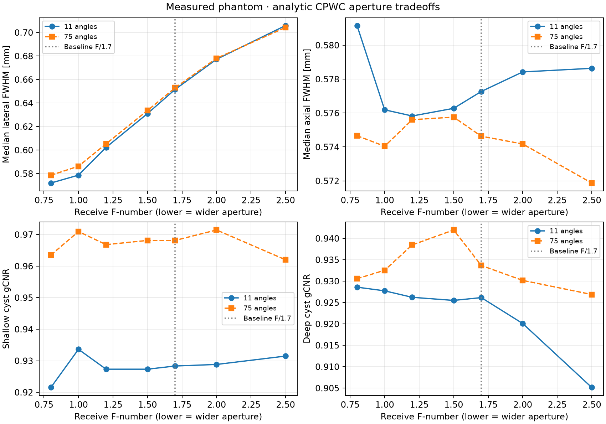
</p>

The separate [runtime/memory profile](artifacts/runtime_profile/README.md) uses the real
carotid cross-section at **F/1.5**, stride 2 and 60 dB. It does **not** benchmark the selected
F/0.8 phantom configuration. Each backend/mode/count runs in a fresh subprocess; one full
warmup is excluded, followed by three timed repeats. Working-set sampling uses an additional
call so the memory sampler does not affect reported timings.

| Backend / mode | Angles | Median runtime [s] | Min–max [s] | Sampled process RSS peak [MiB] |
|---|---:|---:|---:|---:|
| Numba legacy | 11 | 0.062 | 0.062–0.063 | 263.1 |
| Numba analytic | 11 | 0.140 | 0.139–0.334 | 296.9 |
| Numba legacy | 75 | 2.378 | 2.241–2.388 | 310.8 |
| Numba analytic | 75 | 4.934 | 4.715–5.050 | 536.3 |
| NumPy legacy | 11 | 6.280 | 6.066–6.416 | 224.5 |
| NumPy analytic | 11 | 7.356 | 7.028–7.571 | 229.9 |

Analytic processing costs more than legacy real-RF processing. Full-array NumPy/Numba
agreement passed at 11 angles for both modes. No NumPy 75-angle or GPU/native runtime is
claimed. RSS includes input data, interpreter, libraries and retained buffers; the sampled
peak is a lower bound on working-set peak, **not allocated memory**. These single-host
results, including approximately 7.1 FPS at 11 angles and 0.20 FPS at 75 angles, do not
demonstrate a production real-time system.

```bash
ultrasound-aperture-study
ultrasound-profile --repeats 3
```

## v0.5: physical measurements and external analytic validation

The new [phantom report](artifacts/analytic_validation/phantom/README.md) measures linear
envelopes using identical fixed ROIs, F-number 1.7 and stride-2 grids for both methods.
The embedded UFF reference is sampled on that same grid; all seven point targets and both
cysts are retained in the JSON report. Widths are baseline-corrected half-amplitude FWHM.

| Measurement, 11-angle physical phantom | Legacy | Analytic |
|---|---:|---:|
| Deep cyst contrast [dB], more negative = darker than background | −3.07 | **−20.10** |
| Deep cyst CNR | 0.402 | **1.556** |
| Deep cyst gCNR | 0.268 | **0.926** |
| Median axial FWHM [mm], lower = narrower | 0.679 | **0.577** |
| Median lateral FWHM [mm], lower = narrower | **0.599** | 0.652 |

The lateral result is a tradeoff, not an improvement. At 75 angles the analytic deep cyst
gCNR was 0.934, axial FWHM 0.575 mm and lateral FWHM 0.653 mm. All seven target widths were
measurable in both directions. These results are single-acquisition engineering measurements,
not statistical significance, clinical performance or certified scanner calibration.

<p align="center">
  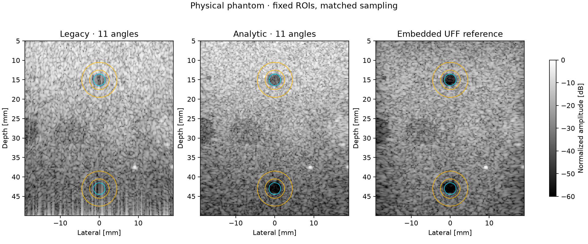
</p>

The [external report](artifacts/analytic_validation/external/README.md) adds EPFL volunteers
005 and 008 and the Alpinion physical phantom. It includes 11/full-angle reconstructions for
both methods and checks linear-envelope consistency when the output grid is subsampled.
The legacy normalized grid discrepancy was 0.0248, 0.0299 and 0.0354 respectively; analytic
discrepancy was zero to numerical precision. This invariance follows from the analytic
construction; **it does not prove anatomical accuracy**.

There is no independent reference for these three cases. Each 11-angle result is compared
only with its own method's full-angle reconstruction (87 angles for EPFL, 21 for Alpinion).
Analytic 11/full SSIM was 0.536 / 0.594 on EPFL and 0.930 on Alpinion. The EPFL values are
lower than the legacy within-method values (0.685 / 0.759); this remains visible and should
not be interpreted as a head-to-head accuracy score. Sparse-angle behavior needs further work.

```bash
ultrasound-validate-analytic
# Run just one part:
ultrasound-validate-analytic --section phantom
ultrasound-validate-analytic --section external
```

The reports retain file and EPFL settings SHA-256 checksums, probe geometry, timing, grid
coordinates, angle indices, dependency versions, fixed ROI definitions and per-target results.
Missing widths are `null`, with valid-target counts; no nonstandard JSON NaN is emitted.
An edge-crossing regression test also prevents valid FWHM measurements next to a profile
boundary from being incorrectly rejected. The old versioned artifacts remain unchanged.

## v0.4: fixing envelope extraction on coarse reconstruction grids

The earlier real-RF path focused onto the output image grid and then applied a depth-axis
Hilbert transform. On the stride-2 PICMUS grid, the axial step is approximately 0.148 mm:
the on-axis equivalent RF Nyquist frequency is only 2.60 MHz. Such a grid can undersample
the focused RF carrier and corrupt subsequent envelope extraction, producing vertical streaks.

The new opt-in path forms the analytic signal **on the original RF channels**, interpolates
and focuses its real and imaginary parts, coherently compounds angles, and takes magnitude.
No sharpening, denoising, TGC, registration or image-generation model is used in this comparison.
This is **analytic RF, not baseband-demodulated IQ**.

| Measured acquisition, 75 angles | Legacy SSIM | Channel-analytic SSIM |
|---|---:|---:|
| Human carotid cross-section | 0.462 | **0.731** |
| Human carotid longitudinal view | 0.460 | **0.749** |
| Physical contrast/speckle phantom | 0.440 | **0.930** |
| Physical resolution/distortion phantom | 0.428 | **0.795** |

All eight before/after cases improved SSIM and dB RMSE against the embedded UFF reference.
These are reconstruction-reference comparisons, not clinical accuracy measurements.
The comparison holds angles, aperture (F-number 1.5), stride (2) and display range (60 dB)
fixed; each image is independently peak-normalized. No cross-dataset aggregate mixes
independent references with self-reconstruction references.

```bash
# After installation and the four PICMUS downloads below:
ultrasound-quality
# Alternative without the optional accelerated backend:
ultrasound-quality --backend numpy --angles 11
```

See the [complete before/after report](artifacts/analytic_quality/README.md), including
eight figures, exact angle selections, acquisition metadata and SHA-256 checksums.
Both `plane_wave_delay_and_sum(..., analytic=True)` and
`numba_plane_wave_delay_and_sum(..., analytic=True)` expose the new path. Their `rf` field
then contains a complex analytic signal; use `abs(result.rf)` for its envelope, not a second
Hilbert transform. Signed DMAS rejects this mode; CF/PCF/MVDR already use analytic channels.
CUDA and native C++ remain real-RF only and have not been benchmarked in analytic mode.

Existing commands keep their legacy defaults for reproducibility. The angle-count, external,
phantom, enhancement, acceleration and ROI results below are historical real-RF baseline
evidence, **not recomputed v0.4 analytic results**. In particular, the old speedup and FWHM
numbers must not be attributed to the new path.

## What the project implements

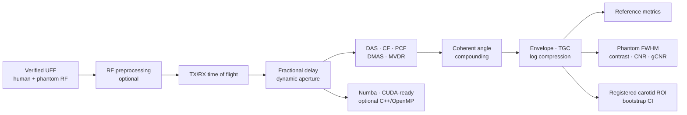

For pixel `(x, z)`, receive element `e`, and plane-wave angle `θ`, the conventional path uses

```text
t(x, z, e, θ) = [x sin(θ) + z cos(θ) + √((x − xₑ)² + z²)] / c
```

with `c = 1540 m/s`, linear fractional-delay interpolation, depth-dependent F-number aperture,
cosine apodization, and coherent transmission compounding.

### Reconstruction and adaptive methods

- conventional normalized delay-and-sum (DAS);
- opt-in channel-analytic DAS/CPWC with grid-independent envelope sampling;
- coherence factor (CF) and phase coherence factor (PCF);
- signed square-root delay-multiply-and-sum (DMAS);
- diagonally loaded, spatially smoothed Capon/MVDR;
- configurable 1, 3, 11, 31, and 75-angle CPWC;
- NumPy reference, parallel Numba CPU, CUDA kernel, and optional C++/OpenMP source.

### Evaluation methods

- correlation, normalized dB RMSE, local SSIM, and PSNR;
- contrast, CNR, generalized CNR, and speckle SNR;
- axial/lateral −6 dB FWHM and nominal target-position error;
- phase-correlation registration, carotid wall sharpness, and 95% bootstrap intervals;
- runtime, FPS, process working set, backend agreement, and speedup.

## Legacy angle-count study: quality versus compute

<p align="center">
  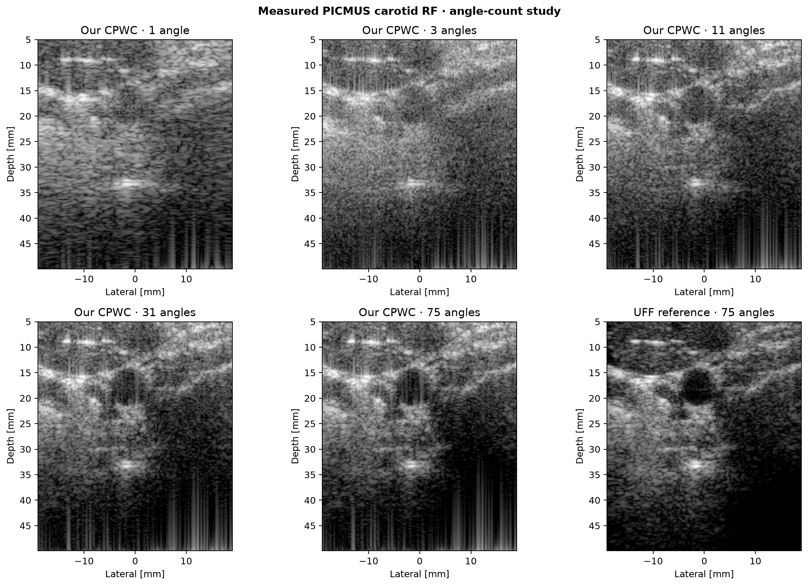
</p>

| Angles | Correlation | RMSE [dB] | SSIM | PSNR [dB] |
|---:|---:|---:|---:|---:|
| 1 | 0.774 | 11.06 | 0.160 | 14.68 |
| 3 | 0.747 | 11.90 | 0.127 | 14.05 |
| 11 | 0.778 | 9.59 | 0.271 | 15.93 |
| 31 | 0.806 | 8.38 | 0.403 | 17.10 |
| 75 | **0.815** | **8.07** | **0.462** | **17.42** |

The non-monotonic 1→3 behavior is retained rather than hidden: the three-angle experiment uses
the two extreme steering angles plus 0°, while a single transmission uses the central 0° wave.
From 11 angles onward, structural similarity improves consistently.

<p align="center">
  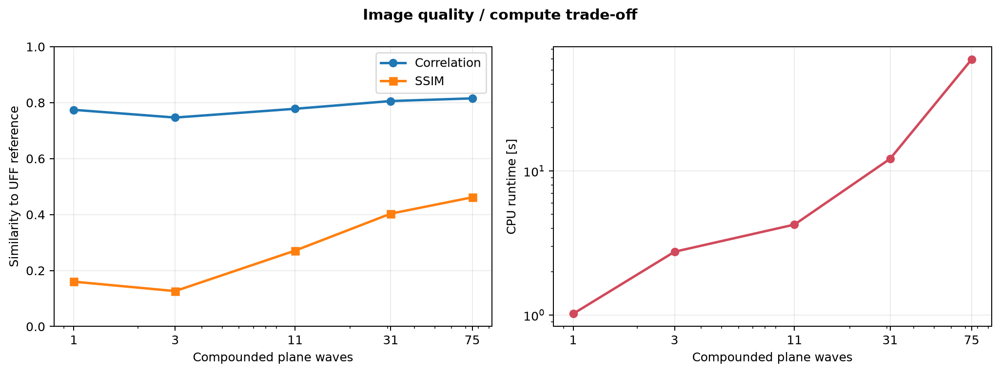
</p>

## Legacy external validation: subjects, views, and probes

The same reconstruction code was next tested on five measured acquisitions: PICMUS carotid
cross/longitudinal views, two explicitly distinct EPFL volunteers, and an Alpinion hypoechoic
phantom. Physical steering-angle selection is independent of storage order, which matters for
the alternating EPFL and Alpinion sequences.

<p align="center">
  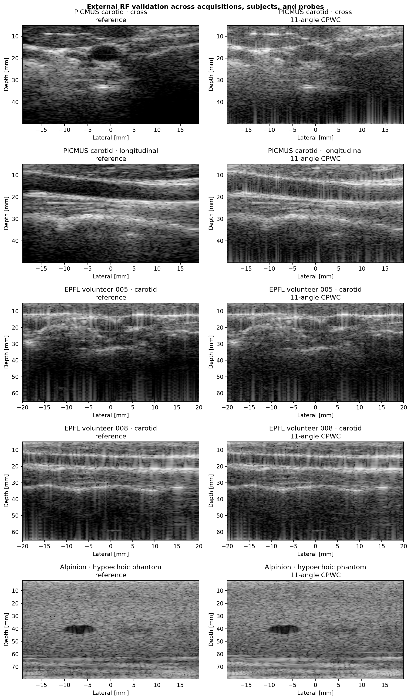
</p>

| Acquisition | Case reference | 11-angle correlation | 11-angle SSIM |
|---|---|---:|---:|
| PICMUS carotid cross | Embedded UFF reference | 0.778 | 0.271 |
| PICMUS carotid longitudinal | Embedded UFF reference | 0.783 | 0.365 |
| EPFL volunteer 005 carotid | Our full 87-angle CPWC | **0.950** | 0.685 |
| EPFL volunteer 008 carotid | Our full 87-angle CPWC | **0.954** | 0.759 |
| Alpinion hypoechoic phantom | Our full 21-angle CPWC | 0.910 | **0.897** |

<p align="center">
  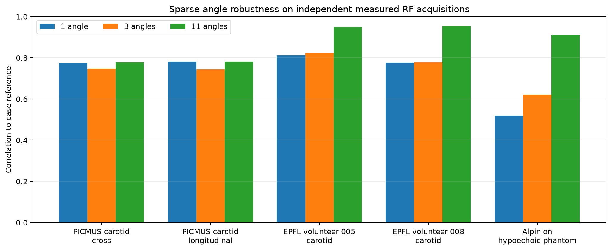
</p>

The EPFL and Alpinion references are full-angle reconstructions from the same acquisitions, so
those rows measure sparse-angle stability rather than diagnostic accuracy. The PICMUS rows use
independently stored UFF beamformed references. These reference types should not be combined
into a single accuracy score.

## Legacy physical phantom validation

The project downloads measured contrast/speckle and resolution/distortion scans recorded on a
CIRS Multi-Purpose Ultrasound Phantom Model 040GSE. The same RF loader and CPWC code reconstruct
both datasets.

<p align="center">
  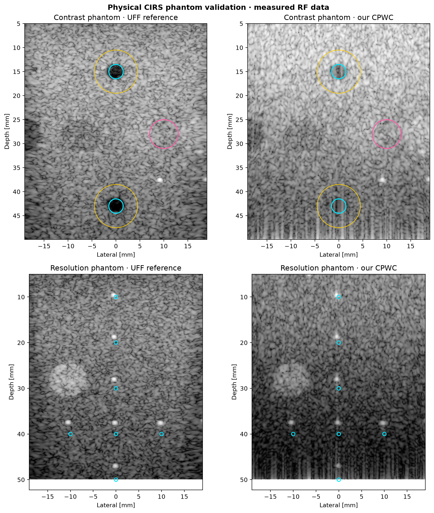
</p>

| Metric | UFF 75-angle reference | Our 11-angle CPWC |
|---|---:|---:|
| Shallow cyst contrast | −28.53 dB | −14.76 dB |
| Shallow cyst gCNR | 0.976 | 0.838 |
| Deep cyst contrast | −23.30 dB | −3.07 dB |
| Speckle SNR | 1.869 | 1.749 |
| Median lateral FWHM | 0.675 mm | **0.599 mm** |
| Median axial FWHM | **0.574 mm** | 0.679 mm |

The deep-cyst loss exposes a genuine limitation of the current 11-angle baseline. It is reported
as a target for further algorithm tuning, not concealed by display processing.

## Adaptive beamformers and enhancement ablation

<p align="center">
  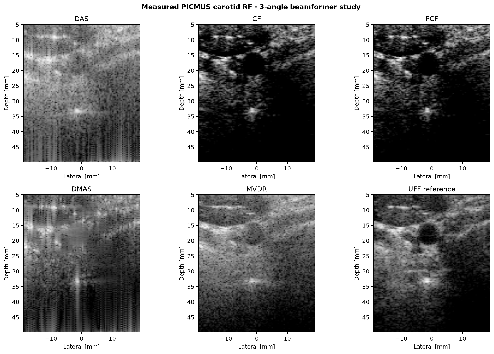
</p>

The adaptive comparison uses identical measured channels, three transmissions, and a coarse grid
to keep MVDR covariance estimation tractable. In that controlled run, MVDR reached 0.784
correlation versus 0.704 for DAS, while CF/PCF strongly suppressed low-coherence regions. Method
outputs have different amplitude statistics, so no method is declared universally superior.

The [enhancement ablation](artifacts/enhancement/enhancement_ablation.png) separately evaluates
RF band-pass filtering, common-mode rejection, automatic TGC, adaptive display range, and
edge-preserving diffusion. RF preprocessing slightly improved correlation from 0.77813 to
0.77841. Strong TGC/despeckling reduced reference similarity and therefore remains optional.

## Acceleration

<p align="center">
  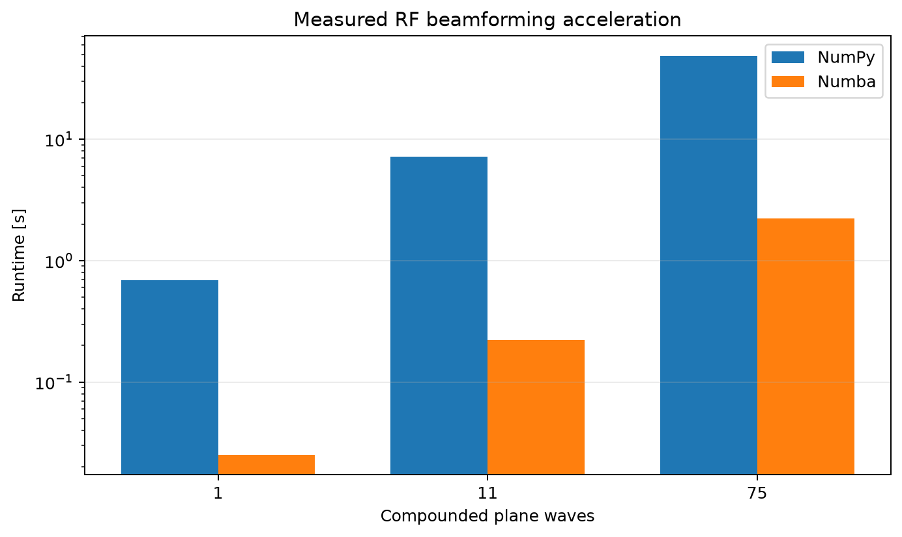
</p>

| Angles | NumPy [s] | Numba [s] | Speedup | B-mode correlation |
|---:|---:|---:|---:|---:|
| 1 | 0.687 | 0.025 | 27.4× | 1.000000 |
| 11 | 7.195 | 0.221 | **32.5×** | 1.000000 |
| 75 | 48.626 | 2.229 | 21.8× | 1.000000 |

One-time JIT compilation (`3.895 s` in this run) is measured separately. A CUDA kernel and a
C++/OpenMP implementation are included as optional backends. This host had no CUDA device and no
built native library, so the report marks them unavailable rather than inventing runtimes.

## Registered carotid ROI with uncertainty

<p align="center">
  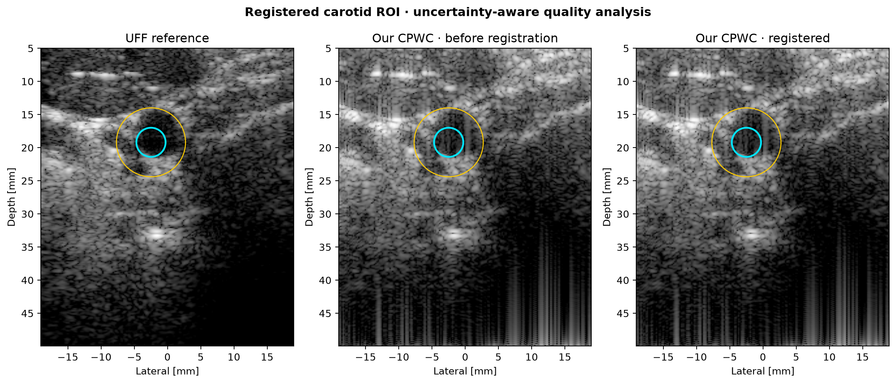
</p>

The ROI is located on the reference inside a constrained carotid search window, then reused for
the registered reconstruction. The 75-angle result reported lumen contrast of −15.72 dB
(`95% CI −16.85 to −14.61 dB`) and gCNR 0.606 (`95% CI 0.544–0.648`). Pixel bootstrap intervals
measure within-ROI sampling variability; they do not represent population or clinical uncertainty.

## Reproduce the complete study

```bash
git clone https://github.com/bekiroruk/ultrasound-bmode-lab.git
cd ultrasound-bmode-lab

python -m venv .venv

# Windows
.venv\Scripts\activate

# Linux/macOS
source .venv/bin/activate

python -m pip install -e ".[dev,accelerated,datasets]"

python scripts/download_picmus.py --dataset carotid
python scripts/download_picmus.py --dataset carotid-long
python scripts/download_picmus.py --dataset contrast
python scripts/download_picmus.py --dataset resolution
python scripts/download_picmus.py --dataset alpinion
python scripts/download_epfl.py --sample all

ultrasound-real --output-dir artifacts/real_data --angles 11
ultrasound-benchmark --output-dir artifacts/benchmark
ultrasound-adaptive --output-dir artifacts/adaptive --angles 3 --stride 4
ultrasound-phantom --output-dir artifacts/phantom --angles 11
ultrasound-enhance --output-dir artifacts/enhancement --angles 11
ultrasound-accelerate --output-dir artifacts/acceleration
ultrasound-roi --output-dir artifacts/roi --angles 75
ultrasound-external --output-dir artifacts/external_validation
ultrasound-quality --output-dir artifacts/analytic_quality
ultrasound-validate-analytic --output-dir artifacts/analytic_validation
ultrasound-aperture-study --output-dir artifacts/aperture_study
ultrasound-profile --output-dir artifacts/runtime_profile --repeats 3

python -m unittest discover -s tests -v
```

The USTB downloader validates published byte sizes and MD5 values. The EPFL downloader uses HTTP
range requests to extract only two selected samples from the large volunteer archives, then
checks member size, ZIP CRC32, and recorded SHA-256. Raw human and phantom RF remain ignored
under `data/raw/`.

## Dataset provenance

The PICMUS and Alpinion acquisitions are distributed through the
[USTB public catalog](https://unioslo.github.io/USTB/datasets.html) and archived as
[Zenodo DOI 10.5281/zenodo.20261898](https://doi.org/10.5281/zenodo.20261898) under **CC BY 4.0**.

- `PICMUS_carotid_cross.uff`: in-vivo human carotid cross-section;
- `PICMUS_carotid_long.uff`: in-vivo human carotid longitudinal view;
- `PICMUS_experiment_contrast_speckle.uff`: physical CIRS contrast/speckle phantom;
- `PICMUS_experiment_resolution_distortion.uff`: physical CIRS resolution/distortion phantom;
- `Alpinion_L3-8_CPWC_hypoechoic.uff`: physical hypoechoic phantom, Alpinion L3-8.

The UFF files describe 75 steered plane waves and a 128-element linear probe. Published examples
identify a Verasonics Vantage 256 research scanner and L11 probe. Numerical reconstruction values
are read from the files. See [real-data provenance](docs/real-data-provenance.md) and
[configuration traceability](docs/configuration-traceability.md).

The [EPFL Ultrafast Ultrasound Dataset](https://www.epfl.ch/labs/lts5/research/us/epfl-ultrafast-ultrasound-datasets/)
contains 20,000 in-vivo acquisitions from nine volunteers. This study deliberately selects one
published carotid acquisition each from held-out volunteers 005 and 008: `invivo_14965.npz` and
`invivo_18198.npz`. Both contain 87 plane-wave transmissions, 192 receive elements, and 2,133
samples, acquired with a GE 9L-D probe. The public metadata contains volunteer identifiers but no
direct identity fields.

### Required dataset citation

H. Liebgott, A. Rodriguez-Molares, F. Cervenansky, J. A. Jensen and O. Bernard,
“Plane-Wave Imaging Challenge in Medical Ultrasound,” *2016 IEEE International Ultrasonics
Symposium*, pp. 1–4, doi:
[10.1109/ULTSYM.2016.7728908](https://doi.org/10.1109/ULTSYM.2016.7728908).

R. Viñals and J.-P. Thiran, “Deep Learning-based Inpainting for Sparse Arrays in Ultrafast
Ultrasound Imaging,” *IEEE Transactions on Computational Imaging*, 2025. See the EPFL dataset
landing page for the authoritative citation and license statement.

## Verification and lifecycle evidence

- [Software requirements](docs/software-requirements.md)
- [Algorithm design](docs/algorithm-design.md)
- [Verification and traceability plan](docs/verification-plan.md)
- [Research risk-management record](docs/risk-management.md)
- [Configuration and data traceability](docs/configuration-traceability.md)
- [Medical-software lifecycle note](docs/medical-software-lifecycle-note.md)

These records borrow useful structure from medical-software engineering. They are not a claim of
IEC 62304, ISO 14971, ISO 13485, FDA, CE, UKCA, or other regulatory compliance.

## Repository structure

```text
ultrasound-bmode-lab/
├── src/ultrasound_bmode/
│   ├── real_data.py          # UFF loader and DAS/CPWC
│   ├── epfl.py               # EPFL multi-volunteer RF adapter
│   ├── adaptive.py           # CF, PCF, DMAS, MVDR
│   ├── accelerated.py        # Numba CPU and CUDA kernels
│   ├── native_backend.py     # Optional C++ bridge
│   ├── processing.py         # Envelope, filtering, TGC, compression, diffusion
│   ├── phantom.py            # Contrast, speckle, FWHM and distortion metrics
│   ├── roi.py                # Registration and uncertainty-aware carotid ROI
│   └── *_cli.py              # Reproducible experiment commands
├── native/                   # Optional C++17/OpenMP DAS backend
├── scripts/                  # Verified USTB and selective EPFL downloaders
├── tests/                    # Synthetic, real-data, metric and backend tests
├── docs/                     # Provenance, requirements, risk and verification records
├── artifacts/                # Versioned figures and machine-readable results
└── .github/workflows/        # Python 3.10/3.12 CI
```

## Known limitations

- Four human acquisitions, including two explicitly distinct EPFL volunteers, remain too small
  for population or clinical generalization; the public PICMUS subject relationship is unstated.
- Human data still comes from research Verasonics workflows; multi-vendor human validation is
  not yet demonstrated. Alpinion coverage is currently limited to a physical phantom.
- The UFF image is an algorithmic reference, not anatomical or diagnostic ground truth.
- EPFL/Alpinion sparse-angle metrics use same-acquisition full-angle CPWC references.
- Constant sound speed, linear interpolation, and simplified receive modelling remain.
- Analytic phantom contrast and axial FWHM improved, but lateral FWHM widened in this study.
- Analytic validation covers four PICMUS acquisitions, two EPFL volunteers and one Alpinion
  phantom; none of these results provides population-level or clinical validation.
- Analytic ROI uncertainty, spatially aware confidence intervals, sparse-angle tuning and
  independent validation of the exploratory F/0.8 candidate remain to be done.
- Runtime/memory profiles cover one host and fixed F/1.5; F/0.8 timing, streaming memory
  optimization and deployment hardware benchmarks remain to be done.
- Adaptive methods need parameter studies on independent acquisitions.
- Bootstrap intervals ignore spatial correlation and between-subject variability.
- CUDA and C++ runtimes require corresponding local hardware/build tools and were unavailable on
  the measured host.

## License

Source code is released under the [MIT License](LICENSE). PICMUS/USTB data is not redistributed by
this repository and remains subject to its own CC BY 4.0 license and attribution requirements.
