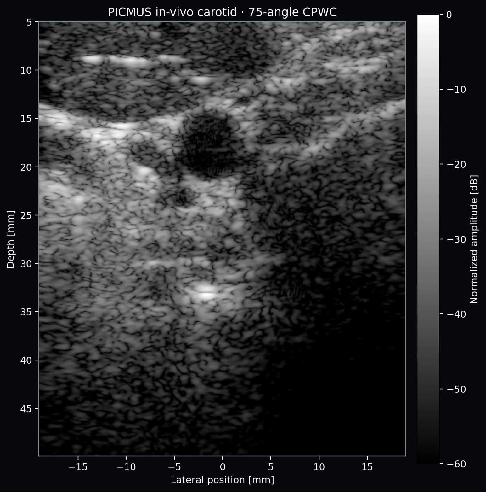
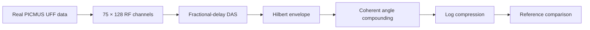

# Ultrasound B-mode Lab

[](https://github.com/bekiroruk/ultrasound-bmode-lab/actions/workflows/ci.yml)
[](https://www.python.org/)
[](LICENSE)

A transparent, testable ultrasound imaging project that reconstructs **real in-vivo carotid RF channel data** and compares single-angle delay-and-sum with coherent plane-wave compounding. It is intentionally built from first principles with NumPy/SciPy instead of hiding reconstruction behind a deep-learning model. A synthetic phantom remains available for controlled verification tests.

> **Scope:** Educational/research software. It is not a medical device and must not be used for diagnosis or clinical decision-making.



The [reconstruction comparison](artifacts/real_data/picmus_reconstruction_comparison.png)
shows measured RF, our single-angle DAS, our 11-angle CPWC, and the dataset's
75-angle reference. The implemented 11-angle result reaches a normalized dB-image
correlation of **0.778** with the 75-angle reference.

## Why this project

The repository demonstrates the complete algorithm chain expected in ultrasound imaging work:



- Real 75-angle, 128-element plane-wave channel data from a human carotid acquisition
- Fractional-delay dynamic receive beamforming with an F-number aperture
- Coherent plane-wave compounding, envelope detection, and dynamic-range compression
- Reproducible download with Zenodo size and MD5 integrity checks
- Dataset reference comparison with correlation and RMSE reporting
- Synthetic cyst and point-target phantoms for controlled algorithm verification
- Typed configuration, command-line interface, unit tests, and GitHub Actions CI
- A requirements-to-test [verification and traceability plan](docs/verification-plan.md)

## Quick start

```bash
python -m venv .venv
# Windows: .venv\Scripts\activate
# Linux/macOS: source .venv/bin/activate
python -m pip install -e ".[dev]"
python scripts/download_picmus.py
ultrasound-real --output-dir artifacts/real_data --angles 11
python -m unittest discover -s tests -v
```

The real-data command writes:

- `picmus_carotid_75_angle.png` — clean in-vivo carotid B-mode reference
- `picmus_reconstruction_comparison.png` — measured RF and 1/11/75-angle comparison
- `real_data_metrics.json` — acquisition metadata, provenance, and similarity measurements

## Real dataset

The project uses the public **PICMUS in-vivo carotid cross-section** UFF file from
the [USTB dataset catalog](https://unioslo.github.io/USTB/datasets.html), archived
as [Zenodo DOI 10.5281/zenodo.20261898](https://doi.org/10.5281/zenodo.20261898)
under CC BY 4.0. The 76.7 MB dataset is downloaded locally and is not committed to Git.

The UFF metadata reports 75 steered plane waves from −16° to +16°, 128 receive
elements, 1,536 RF samples per channel, a 20.832 MHz sampling frequency, and a
1,540 m/s sound-speed assumption. See the complete
[data provenance and citation record](docs/real-data-provenance.md).

Required citation: H. Liebgott, A. Rodriguez-Molares, F. Cervenansky, J. A. Jensen,
and O. Bernard, “Plane-Wave Imaging Challenge in Medical Ultrasound,” IEEE IUS,
2016, doi: `10.1109/ULTSYM.2016.7728908`.

## Synthetic verification mode

The deterministic simulator remains useful for tests with known ground truth:

```bash
ultrasound-bmode --output-dir artifacts/synthetic
```

To explore array size and scan density:

```bash
ultrasound-bmode --elements 64 --lines 96 --seed 11
```

Generate a clean point-target image for inspecting the point-spread function:

```bash
ultrasound-bmode --phantom resolution --elements 64 --lines 96 \
  --output-dir artifacts/resolution
```

## Algorithm notes

For a pixel at position **r** and receive element **e**, the delay-and-sum time is

```text
t(r, e) = (|r - r_tx| + |r - r_e|) / c
```

where `c = 1540 m/s`. RF samples are evaluated at fractional delays using linear interpolation. A depth-dependent receive aperture is selected using an F-number constraint, then Hanning apodization is applied before coherent summation.

The analytic-signal magnitude gives the envelope. TGC compensates the simulated two-way attenuation before normalization and log compression. The default display range is 60 dB.

The cyst is evaluated with a circular target ROI and a surrounding annular background ROI:

- **Contrast (dB):** ratio of mean target and background envelopes
- **CNR:** mean separation normalized by combined variance
- **gCNR:** one minus the overlap of target/background intensity histograms

## Repository layout

```text
src/ultrasound_bmode/
  real_data.py      UFF reader and real plane-wave DAS/CPWC
  real_cli.py       Real-data comparison and provenance export
  simulation.py     Point-scatterer phantom and RF acquisition
  beamforming.py    Dynamic delay-and-sum reconstruction
  processing.py     Envelope, TGC, compression, scan conversion
  metrics.py        Contrast, CNR, and generalized CNR
  pipeline.py       End-to-end orchestration
  cli.py            Reproducible demo export
scripts/             Verified public-dataset downloader
tests/               Focused unit tests for signal-processing stages
```

## Engineering trade-offs and next steps

The simulator is deliberately lightweight: it does not model nonlinear propagation, transducer impulse-response calibration, refraction, or tissue motion. That boundary keeps each algorithm inspectable and the demo runnable on a laptop.

Good extensions for real acquisition data are:

1. Import a public PICMUS/USTB dataset and compare reconstruction against a reference.
2. Add coherent plane-wave compounding and contrast-optimized beamformers (DMAS/MVDR).
3. Profile the pipeline, then port the delay kernel to Numba/CUDA or C++.
4. Add axial/lateral resolution and speckle SNR measurements from phantom data.
5. Introduce requirements-to-test traceability suitable for a medical-device software lifecycle.

## Reproducibility

All random sources use explicit seeds. Physical quantities are stored in SI units internally and labeled units are used at display boundaries. Tests cover delay focusing, signal envelopes, TGC behavior, compression range, metric directionality, and parameter validation.

## License

MIT — see [LICENSE](LICENSE).
