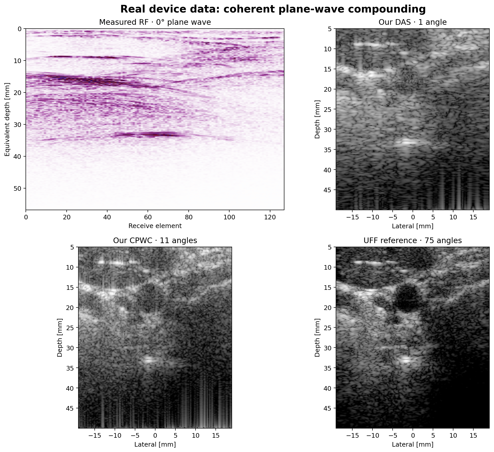

<div align="center">

# Ultrasound B-mode Lab

### Real RF channel data → Delay-and-Sum → Coherent Plane-Wave Compounding → B-mode

[](https://github.com/bekiroruk/ultrasound-bmode-lab/actions/workflows/ci.yml)
[](https://www.python.org/)
[](https://doi.org/10.5281/zenodo.20261898)
[](https://creativecommons.org/licenses/by/4.0/)
[](LICENSE)

An inspectable ultrasound image-formation pipeline built from first principles.
It reconstructs public **in-vivo human carotid RF channel data** and measures how
single-angle DAS and multi-angle CPWC approach the dataset's 75-angle reference.

> Research and educational software only. This repository is not a medical device
> and must not be used for diagnosis or clinical decision-making.

</div>

<p align="center">
  
</p>

## Result at a glance

| Item | Value |
|---|---:|
| Acquisition | PICMUS in-vivo carotid cross-section |
| Raw tensor | 75 transmissions × 128 elements × 1,536 RF samples |
| Steering range | −16° to +16° |
| Sampling frequency | 20.832 MHz |
| Implemented reconstruction | Fractional-delay DAS + 11-angle CPWC |
| Reference | UFF 75-angle compounded image |
| 11-angle/reference correlation | **0.778** |
| RMSE in normalized dB space | **9.59 dB** |
| Automated tests | **13 passing** with the installed dataset |

<p align="center">
  
</p>

The comparison above contains, in reading order:

1. measured receive-channel RF for the 0° transmission;
2. our single-angle delay-and-sum reconstruction;
3. our coherent reconstruction from 11 selected steering angles; and
4. the 75-angle reference stored in the public UFF file.

## What this demonstrates

- Loading real UFF/HDF5 acquisition data without discarding scanner metadata
- Plane-wave transmit and element-dependent receive time-of-flight calculation
- Linear interpolation for fractional-sample delays
- Depth-dependent F-number aperture with cosine apodization
- Coherent compounding over configurable steering-angle subsets
- Hilbert-envelope detection and 60 dB log compression
- Reproducible dataset download with size and MD5 verification
- Quantitative comparison against a published reference reconstruction
- Controlled cyst and point-target simulations for tests with known ground truth
- Requirements-to-test traceability and automated CI

## Processing pipeline

```mermaid
flowchart LR
    A[Public PICMUS UFF] --> B[RF tensor<br/>75 × 128 × 1536]
    B --> C[Transmit + receive<br/>time of flight]
    C --> D[Fractional-delay<br/>interpolation]
    D --> E[Dynamic aperture<br/>and apodization]
    E --> F[Delay-and-sum]
    F --> G[Coherent angle<br/>compounding]
    G --> H[Hilbert envelope]
    H --> I[60 dB log<br/>compression]
    I --> J[Reference metrics<br/>and figures]
```



For a pixel at `(x, z)`, receive element `e`, and plane-wave angle `θ`, the
implemented delay is

```text
t(x, z, e, θ) = [x sin(θ) + z cos(θ) + √((x − xₑ)² + z²)] / c
```

where `c = 1540 m/s`. The RF signal is sampled at this delay using linear
interpolation. Valid receive elements are weighted by a depth-dependent aperture,
summed coherently, and then compounded across transmission angles.

## Quick start

```bash
git clone https://github.com/bekiroruk/ultrasound-bmode-lab.git
cd ultrasound-bmode-lab

python -m venv .venv

# Windows
.venv\Scripts\activate

# Linux/macOS
source .venv/bin/activate

python -m pip install -e ".[dev]"
python scripts/download_picmus.py
ultrasound-real --output-dir artifacts/real_data --angles 11
python -m unittest discover -s tests -v
```

`download_picmus.py` retrieves the 76.7 MB file from the immutable Zenodo record,
then validates its published size and MD5 checksum. Raw human data remains outside
Git under `data/raw/`.

### Generated real-data artifacts

| File | Purpose |
|---|---|
| `picmus_carotid_75_angle.png` | Clean reference B-mode image |
| `picmus_reconstruction_comparison.png` | RF and 1/11/75-angle comparison |
| `real_data_metrics.json` | Acquisition, provenance and similarity metrics |

## Dataset provenance

This project uses `PICMUS_carotid_cross.uff` from the
[USTB public dataset catalog](https://unioslo.github.io/USTB/datasets.html),
archived as [Zenodo DOI 10.5281/zenodo.20261898](https://doi.org/10.5281/zenodo.20261898)
under **CC BY 4.0**.

The UFF file describes an in-vivo human carotid cross-section acquired with 75
steered plane waves and a 128-element linear probe. Published descriptions identify
the acquisition platform as a Verasonics Vantage 256 research scanner with an
L11/L11-4v probe. Numerical reconstruction parameters are read directly from the
UFF file.

See [real-data provenance](docs/real-data-provenance.md) for the integrity values,
acquisition metadata, handling notes and full citation.

### Required dataset citation

H. Liebgott, A. Rodriguez-Molares, F. Cervenansky, J. A. Jensen and O. Bernard,
“Plane-Wave Imaging Challenge in Medical Ultrasound,” *2016 IEEE International
Ultrasonics Symposium (IUS)*, pp. 1–4,
doi: [10.1109/ULTSYM.2016.7728908](https://doi.org/10.1109/ULTSYM.2016.7728908).

## Controlled verification mode

Real data establish practical relevance; deterministic phantoms provide known
ground truth for algorithm tests.

```bash
# Speckle and anechoic cyst
ultrasound-bmode --output-dir artifacts/synthetic

# Isolated reflectors for point-spread-function inspection
ultrasound-bmode --phantom resolution --elements 64 --lines 96 \
  --output-dir artifacts/resolution
```

The synthetic pipeline covers band-limited RF generation, propagation delay,
attenuation, noise, dynamic receive beamforming, TGC, scan conversion, contrast,
CNR and generalized CNR.

## Verification

The test suite checks:

- axial focusing of a known reflector;
- RF envelope and log-compression behavior;
- monotonic time-gain compensation;
- contrast, CNR and gCNR directionality;
- Nyquist and tensor-shape validation;
- UFF dimensions and acquisition metadata;
- finite reconstruction from measured RF data; and
- reproducible steering-angle selection.

The [verification and traceability plan](docs/verification-plan.md) maps algorithm
requirements to their corresponding tests and acceptance criteria.

## Repository structure

```text
ultrasound-bmode-lab/
├── src/ultrasound_bmode/
│   ├── real_data.py       # UFF reader and real plane-wave DAS/CPWC
│   ├── real_cli.py        # Real-data figures and metric export
│   ├── beamforming.py     # Synthetic dynamic delay-and-sum
│   ├── simulation.py      # Cyst and point-target RF simulation
│   ├── processing.py      # Envelope, TGC, compression, scan conversion
│   ├── metrics.py         # Contrast, CNR and generalized CNR
│   └── pipeline.py        # Synthetic end-to-end orchestration
├── scripts/
│   └── download_picmus.py # Verified Zenodo downloader
├── tests/                 # Unit and installed-dataset tests
├── docs/                  # Provenance and verification records
├── artifacts/             # Reproducible figures and JSON results
└── .github/workflows/     # Python 3.10/3.12 CI
```

## Limitations and roadmap

Current reconstruction uses CPU NumPy, linear delay interpolation and a conventional
cosine-apodized DAS baseline. The included 75-angle image is the dataset reference;
our configurable implementation currently demonstrates the quality/compute trade-off
with 1 and 11 angles.

Planned engineering extensions:

1. benchmark 1, 3, 11, 31 and 75 angles with runtime/quality curves;
2. add DMAS and MVDR baselines on the same measured channels;
3. introduce axial/lateral resolution and speckle-SNR phantom measurements;
4. accelerate the delay kernel with Numba/CUDA or C++;
5. add registered carotid ROIs and uncertainty-aware image-quality metrics; and
6. expand lifecycle documentation toward medical-device software practices.

## License

Source code is released under the [MIT License](LICENSE). The PICMUS/USTB data is
not redistributed by this repository and remains subject to its own CC BY 4.0
license and attribution requirements.
