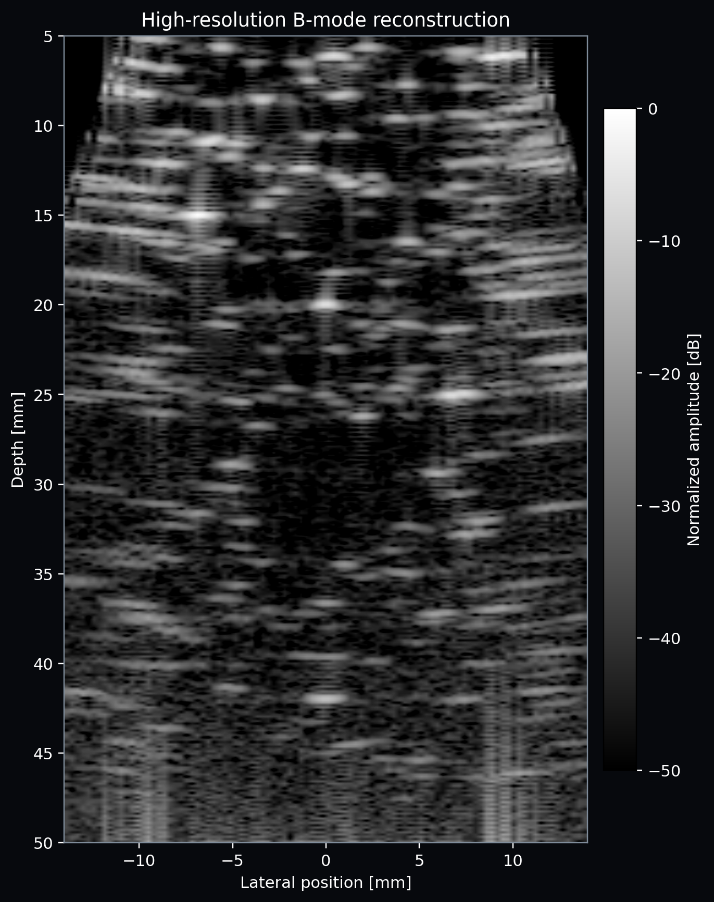
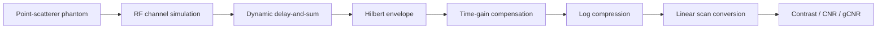

# Ultrasound B-mode Lab

[](https://github.com/bekiroruk/ultrasound-bmode-lab/actions/workflows/ci.yml)
[](https://www.python.org/)
[](LICENSE)

A transparent, testable ultrasound imaging project that turns synthetic RF channel data into a B-mode image and evaluates image quality quantitatively. It is intentionally built from first principles with NumPy/SciPy instead of hiding reconstruction behind a deep-learning model.

> **Scope:** Educational/research software. It is not a medical device and must not be used for diagnosis or clinical decision-making.



The complete observable signal chain is also exported as
[`artifacts/pipeline_stages.png`](artifacts/pipeline_stages.png); the isolated-reflector
phantom provides a separate point-spread-function sanity check.

## Why this project

The repository demonstrates the complete algorithm chain expected in ultrasound imaging work:



- Band-limited RF pulse synthesis, propagation delay, attenuation, noise, and array geometry
- Fractional-delay dynamic receive beamforming with F-number aperture and Hanning apodization
- Envelope detection, TGC, dynamic-range compression, and Cartesian presentation
- Reproducible cyst phantom and objective image-quality measurements
- Typed configuration, command-line interface, unit tests, and GitHub Actions CI
- A requirements-to-test [verification and traceability plan](docs/verification-plan.md)

## Quick start

```bash
python -m venv .venv
# Windows: .venv\Scripts\activate
# Linux/macOS: source .venv/bin/activate
python -m pip install -e ".[dev]"
ultrasound-bmode --output-dir artifacts
python -m unittest discover -s tests -v
```

The command writes:

- `artifacts/bmode_demo.png` — reconstructed image, ROIs, and center-line profile
- `artifacts/metrics.json` — machine-readable contrast, CNR, and gCNR results

To explore array size and scan density:

```bash
ultrasound-bmode --elements 64 --lines 96 --seed 11
```

Generate a clean point-target image for inspecting the point-spread function:

```bash
ultrasound-bmode --phantom resolution --elements 64 --lines 96 \
  --output-dir artifacts/resolution
```

## Algorithm notes

For a pixel at position **r** and receive element **e**, the delay-and-sum time is

```text
t(r, e) = (|r - r_tx| + |r - r_e|) / c
```

where `c = 1540 m/s`. RF samples are evaluated at fractional delays using linear interpolation. A depth-dependent receive aperture is selected using an F-number constraint, then Hanning apodization is applied before coherent summation.

The analytic-signal magnitude gives the envelope. TGC compensates the simulated two-way attenuation before normalization and log compression. The default display range is 60 dB.

The cyst is evaluated with a circular target ROI and a surrounding annular background ROI:

- **Contrast (dB):** ratio of mean target and background envelopes
- **CNR:** mean separation normalized by combined variance
- **gCNR:** one minus the overlap of target/background intensity histograms

## Repository layout

```text
src/ultrasound_bmode/
  simulation.py     Point-scatterer phantom and RF acquisition
  beamforming.py    Dynamic delay-and-sum reconstruction
  processing.py     Envelope, TGC, compression, scan conversion
  metrics.py        Contrast, CNR, and generalized CNR
  pipeline.py       End-to-end orchestration
  cli.py            Reproducible demo export
tests/               Focused unit tests for signal-processing stages
```

## Engineering trade-offs and next steps

The simulator is deliberately lightweight: it does not model nonlinear propagation, transducer impulse-response calibration, refraction, or tissue motion. That boundary keeps each algorithm inspectable and the demo runnable on a laptop.

Good extensions for real acquisition data are:

1. Import a public PICMUS/USTB dataset and compare reconstruction against a reference.
2. Add coherent plane-wave compounding and contrast-optimized beamformers (DMAS/MVDR).
3. Profile the pipeline, then port the delay kernel to Numba/CUDA or C++.
4. Add axial/lateral resolution and speckle SNR measurements from phantom data.
5. Introduce requirements-to-test traceability suitable for a medical-device software lifecycle.

## Reproducibility

All random sources use explicit seeds. Physical quantities are stored in SI units internally and labeled units are used at display boundaries. Tests cover delay focusing, signal envelopes, TGC behavior, compression range, metric directionality, and parameter validation.

## License

MIT — see [LICENSE](LICENSE).
