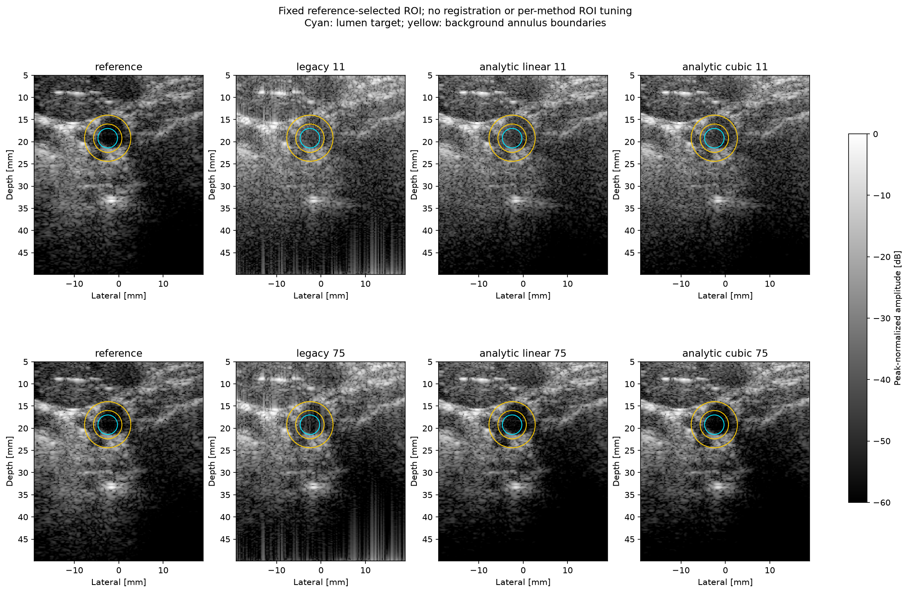

# Analytic carotid ROI and spatial uncertainty

One previously inspected PICMUS human carotid cross-section. The circular heuristic ROI is not a clinical segmentation and must not be transferred to longitudinal views. Reference is the same-acquisition embedded UFF reconstruction, not ground truth. No registration is applied: all results share exact metadata coordinates. Integer phase-correlation shifts are diagnostic only and do not alter the ROI.

F/1.7, stride 2, metadata sound speed; no TGC or denoising. Metrics use linear
envelopes; figures use separately peak-normalized 60 dB displays.

## Fixed-ROI estimates and block-size sensitivity

Intervals below are conditional 2.5–97.5 percentile resampling ranges, not
validated clinical confidence intervals. The 1×1 case is an occupied-pixel
baseline, not the legacy stratified fixed-sample-count pixel bootstrap.

| Image | Contrast dB | CNR | gCNR | gCNR interval 1×1 | 4×4 | 8×8 | 16×16 |
|---|---:|---:|---:|---|---|---|---|
| reference | -19.37 | 0.594 | 0.574 | [0.541, 0.611] | [0.474, 0.670] | [0.419, 0.717] | [0.361, 0.770] |
| legacy_11 | -11.00 | 0.562 | 0.449 | [0.423, 0.488] | [0.384, 0.533] | [0.352, 0.582] | [0.300, 0.630] |
| analytic_linear_11 | -11.74 | 0.535 | 0.404 | [0.376, 0.449] | [0.330, 0.497] | [0.290, 0.543] | [0.256, 0.613] |
| analytic_cubic_11 | -12.03 | 0.534 | 0.412 | [0.376, 0.454] | [0.336, 0.502] | [0.295, 0.550] | [0.254, 0.611] |
| legacy_75 | -15.67 | 0.587 | 0.587 | [0.548, 0.635] | [0.474, 0.666] | [0.449, 0.700] | [0.405, 0.769] |
| analytic_linear_75 | -19.00 | 0.558 | 0.546 | [0.514, 0.583] | [0.443, 0.640] | [0.398, 0.688] | [0.338, 0.742] |
| analytic_cubic_75 | -19.81 | 0.562 | 0.544 | [0.510, 0.579] | [0.445, 0.637] | [0.397, 0.687] | [0.336, 0.746] |

## Paired changes: first minus second

Both methods receive exactly the same tile draws. Differences are conditional
ROI metric changes, not diagnostic improvement or a population hypothesis test.

| Comparison | Block pixels | gCNR change | Percentile range |
|---|---:|---:|---|
| analytic_linear_11 − legacy_11 | 1 | -0.0450 | [-0.0793, -0.0144] |
| analytic_cubic_11 − analytic_linear_11 | 1 | +0.0085 | [-0.0149, +0.0257] |
| analytic_linear_75 − legacy_75 | 1 | -0.0412 | [-0.0876, +0.0025] |
| analytic_cubic_75 − analytic_linear_75 | 1 | -0.0019 | [-0.0116, +0.0064] |
| analytic_linear_11 − legacy_11 | 4 | -0.0450 | [-0.0897, -0.0006] |
| analytic_cubic_11 − analytic_linear_11 | 4 | +0.0085 | [-0.0150, +0.0247] |
| analytic_linear_75 − legacy_75 | 4 | -0.0412 | [-0.0912, +0.0495] |
| analytic_cubic_75 − analytic_linear_75 | 4 | -0.0019 | [-0.0117, +0.0120] |
| analytic_linear_11 − legacy_11 | 8 | -0.0450 | [-0.1048, +0.0043] |
| analytic_cubic_11 − analytic_linear_11 | 8 | +0.0085 | [-0.0118, +0.0228] |
| analytic_linear_75 − legacy_75 | 8 | -0.0412 | [-0.1158, +0.0571] |
| analytic_cubic_75 − analytic_linear_75 | 8 | -0.0019 | [-0.0118, +0.0088] |
| analytic_linear_11 − legacy_11 | 16 | -0.0450 | [-0.1119, +0.0636] |
| analytic_cubic_11 − analytic_linear_11 | 16 | +0.0085 | [-0.0219, +0.0209] |
| analytic_linear_75 − legacy_75 | 16 | -0.0412 | [-0.1403, +0.0569] |
| analytic_cubic_75 − analytic_linear_75 | 16 | -0.0019 | [-0.0130, +0.0584] |

## Resampling protocol and limitations

Fixed ROI, fixed grid origin and one acquisition; partial tiles retain their masks. Pixel counts vary across replicates. Dependence within tiles is retained, dependence between tiles is not. Resamples lacking either ROI are rejected and counted. Block sizes are sensitivity settings, not estimated correlation lengths. No calibrated 95% coverage, ROI-selection, registration, inter-subject or clinical uncertainty claim. At least four blocks per ROI is a guard, not a sufficiency proof.

64-bin histogram overlap; shared target/background min-max edges recomputed for each image and replicate, matching the existing point estimator. Histogram-bin and finite-sample bias sensitivity are not calibrated.

All ROI-intersecting tiles are sampled with replacement. Partial boundary tiles
retain all included pixels; the same multiplicities apply to every image.
This exploratory cluster-resampling implementation does not estimate an optimal
block size or calibrate interval coverage. The annulus may include heterogeneous
tissue; ROI selection and tile-origin sensitivity are not included.

Background on dependent-data resampling: [Shalizi, bootstrap lecture](https://www.stat.cmu.edu/~cshalizi/dst/20/lectures/16/lecture-16.html).
This is motivation, not a proof of coverage for these image metrics.

[Full settings, provenance, block support and all metric intervals](metrics.json)
