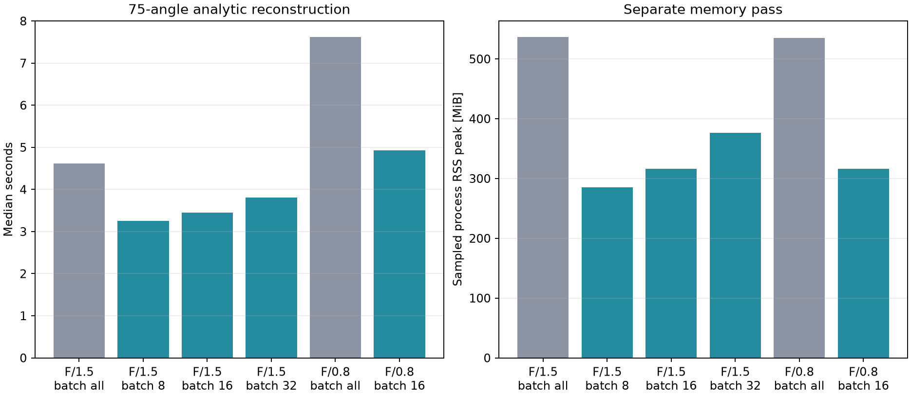

# Angle-batched analytic CPWC profile

Fresh sequential subprocess for each F-number/batch configuration. One full warmup, then repeated timed calls; RSS sampling in a separate additional call. Includes channel preparation, analytic transformation, beamforming and log compression. Excludes loading, warmup/JIT/cache startup, saving and plotting.

Input RF remains resident: angle batching is not disk/device streaming. RSS includes interpreter, libraries, input and retained buffers; sampled peak is a lower bound, not total allocated bytes. Single-host measurements, not real-time certification. F/0.8 is still exploratory; timing does not validate its image quality.

| F-number | Angle batch | Median s | Min–max s | FPS | Baseline / peak RSS MiB |
|---:|---|---:|---:|---:|---:|
| 1.5 | All 75 | 4.622 | 4.617–4.812 | 0.22 | 255.7 / 537.0 |
| 1.5 | 8 | 3.251 | 3.244–3.280 | 0.31 | 255.6 / 285.7 |
| 1.5 | 16 | 3.450 | 3.393–3.510 | 0.29 | 253.9 / 316.2 |
| 1.5 | 32 | 3.808 | 3.709–3.813 | 0.26 | 253.8 / 376.2 |
| 0.8 | All 75 | 7.624 | 7.484–7.695 | 0.13 | 253.6 / 535.0 |
| 0.8 | 16 | 4.931 | 4.921–4.974 | 0.20 | 253.6 / 315.9 |

Every batched full RF/B-mode array passed comparison to the unbatched result at the same F-number.

[Raw repetitions, host, settings and parity errors](metrics.json)
