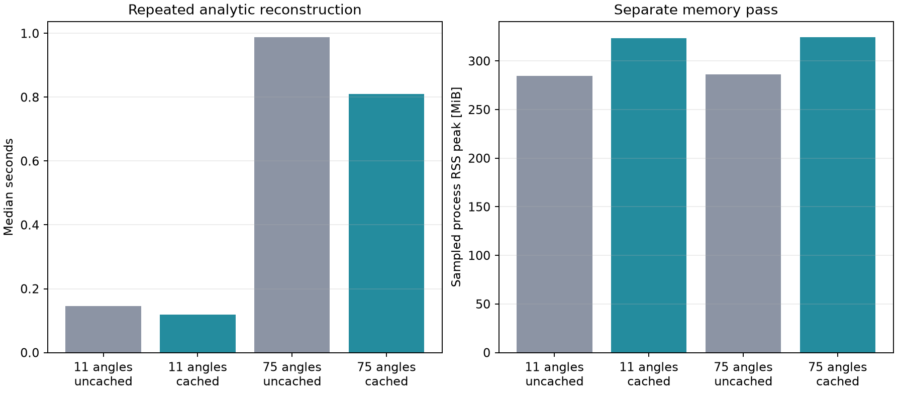

# Reusable analytic-channel cache profile

Fresh sequential subprocess for each cached/uncached angle-count configuration. Cache preparation occurs once after loading and before reconstruction profiling. Each profile excludes one full warmup, times repeated reconstruction calls without RSS sampling, then samples RSS during a separate extra call. Cache preparation time is measured but its temporary peak RSS is not sampled.

The in-memory cache stores one full real quadrature tensor and assumes its exact source channel array is not mutated. Cached RSS includes that resident tensor. This optimizes repeated reconstructions of one loaded acquisition; it does not reduce first-use latency, raw input residency, or provide persistent disk caching. Single-host research measurements, not real-time certification.

| Angles | Cache | Median s | Min–max s | RSS baseline / peak MiB | Cache prep s / MiB |
|---:|---|---:|---:|---:|---:|
| 11 | no | 0.146 | 0.143–0.149 | 254.3 / 284.8 | N/A |
| 11 | yes | 0.119 | 0.117–0.127 | 310.3 / 323.2 | 0.168 / 56.2 |
| 75 | no | 0.988 | 0.968–1.116 | 254.0 / 286.4 | N/A |
| 75 | yes | 0.810 | 0.799–0.812 | 310.0 / 324.4 | 0.160 / 56.2 |

| Angles | Repeated-call reduction | RSS peak increase | Break-even calls |
|---:|---:|---:|---:|
| 11 | 18.3% | 38.5 MiB | 7 |
| 75 | 18.0% | 38.0 MiB | 1 |

Break-even includes the one-time cache preparation measurement, but excludes file loading and compilation. It is specific to this run and host.

Cached and uncached full RF/B-mode arrays passed at both angle counts.

[Raw repetitions, preparation cost, host and parity errors](metrics.json)
