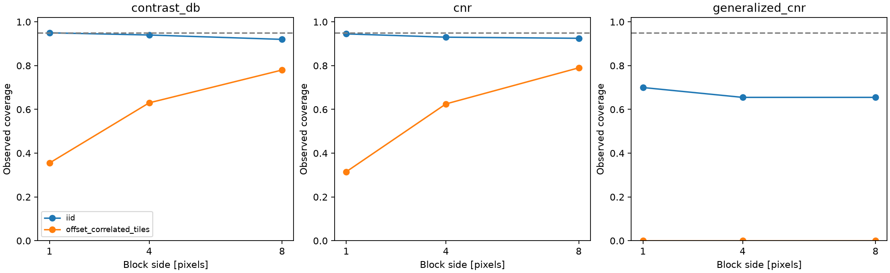

# Controlled uncertainty coverage audit

Synthetic envelopes with exactly known marginal Rayleigh distributions, not RF acquisitions. IID pixels and 4x4 constant tiles offset by two pixels. Fixed mask and origin. Each trial is independently generated; same field across block sizes. Coverage means interval contains the population metric. Continuous gCNR truth is compared to the existing adaptive 64-bin estimator, retaining histogram bias.

Finite Monte Carlo precision is quantified with Wilson intervals. No clinical coverage guarantee or automatic correction factor. Tile model is not a tissue model; ROI selection, paired changes and other correlation structures are untested. No block size is selected from these trials.

200 fields/scenario; 300 resamples/interval.

| Scenario | Block | Metric | Coverage | Wilson 95% | Bias |
|---|---:|---|---:|---|---:|
| iid | 1 | contrast_db | 0.950 | [0.910, 0.973] | -0.0134 |
| iid | 1 | cnr | 0.945 | [0.904, 0.969] | +0.0003 |
| iid | 1 | generalized_cnr | 0.700 | [0.633, 0.759] | +0.0177 |
| iid | 4 | contrast_db | 0.940 | [0.898, 0.965] | -0.0134 |
| iid | 4 | cnr | 0.930 | [0.886, 0.958] | +0.0003 |
| iid | 4 | generalized_cnr | 0.655 | [0.587, 0.717] | +0.0177 |
| iid | 8 | contrast_db | 0.920 | [0.874, 0.950] | -0.0134 |
| iid | 8 | cnr | 0.925 | [0.880, 0.954] | +0.0003 |
| iid | 8 | generalized_cnr | 0.655 | [0.587, 0.717] | +0.0177 |
| offset_correlated_tiles | 1 | contrast_db | 0.355 | [0.292, 0.423] | -0.1202 |
| offset_correlated_tiles | 1 | cnr | 0.315 | [0.255, 0.382] | +0.0323 |
| offset_correlated_tiles | 1 | generalized_cnr | 0.000 | [0.000, 0.019] | +0.2836 |
| offset_correlated_tiles | 4 | contrast_db | 0.630 | [0.561, 0.694] | -0.1202 |
| offset_correlated_tiles | 4 | cnr | 0.625 | [0.556, 0.689] | +0.0323 |
| offset_correlated_tiles | 4 | generalized_cnr | 0.000 | [0.000, 0.019] | +0.2836 |
| offset_correlated_tiles | 8 | contrast_db | 0.780 | [0.718, 0.832] | -0.1202 |
| offset_correlated_tiles | 8 | cnr | 0.790 | [0.728, 0.841] | +0.0323 |
| offset_correlated_tiles | 8 | generalized_cnr | 0.000 | [0.000, 0.019] | +0.2836 |

Nominal 95% percentile intervals are not automatically 95%-coverage intervals.
The displayed coverage is an observed frequency, not a pass/fail certification.

[Raw trials](metrics.json)
