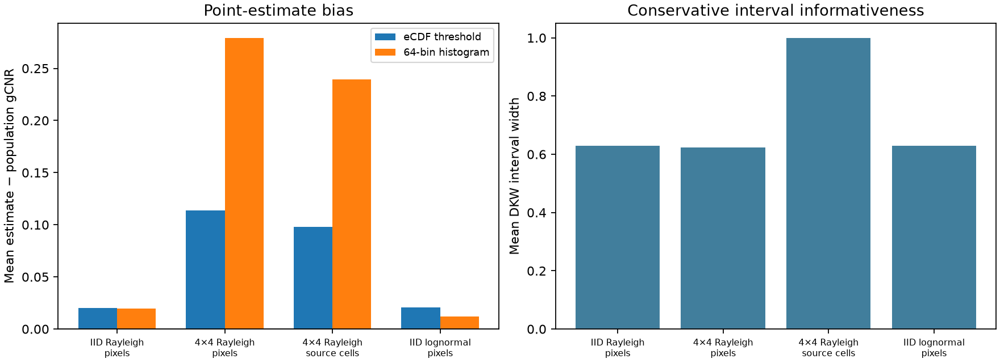

# Bin-free threshold separation: coverage and measured-phantom audit

Independently generated synthetic envelope fields, not RF. Rayleigh and same-shape lognormal pairs each have one population density crossing, so population eCDF range equals gCNR. Same fixed circular ROIs as the previous coverage audit. The correlated generator repeats independent Rayleigh source cells in offset 4x4 tiles. One value per occupied source cell is an oracle diagnostic, not an estimated decorrelation method.

DKW coverage is distribution-free for independent samples within each region, not for correlated image pixels. The source-cell diagnostic knows the synthetic generator; measured images do not. The eCDF range can understate general multimodal density-overlap gCNR. No clinical or measured-image 95% interval claim.

200 independent fields per scenario; 95% DKW simultaneous-CDF bounds.
Method: [Schlunk & Byram (2023)](https://doi.org/10.1109/TUFFC.2023.3289157).

| Scenario | Sampling | eCDF bias | 64-bin bias | DKW coverage | Mean width |
|---|---|---:|---:|---:|---:|
| iid_rayleigh | pixels | +0.0199 | +0.0197 | 1.000 | 0.629 |
| offset_correlated_rayleigh | pixels | +0.1135 | +0.2793 | 0.985 | 0.623 |
| offset_correlated_rayleigh | source_cells | +0.0979 | +0.2393 | 1.000 | 1.000 |
| iid_lognormal_stress | pixels | +0.0210 | +0.0121 | 1.000 | 0.629 |

## Physical phantom, measured device RF

Point estimates only; the eCDF column is threshold separation, not a validated general gCNR or a calibrated interval.

| Image | Cyst depth | eCDF threshold | 64-bin gCNR |
|---|---:|---:|---:|
| analytic_11_angles | 15 mm | 0.940 | 0.928 |
| analytic_11_angles | 43 mm | 0.931 | 0.926 |
| embedded_uff_reference | 15 mm | 0.975 | 0.972 |
| embedded_uff_reference | 43 mm | 0.938 | 0.934 |

[Raw records](metrics.json)
