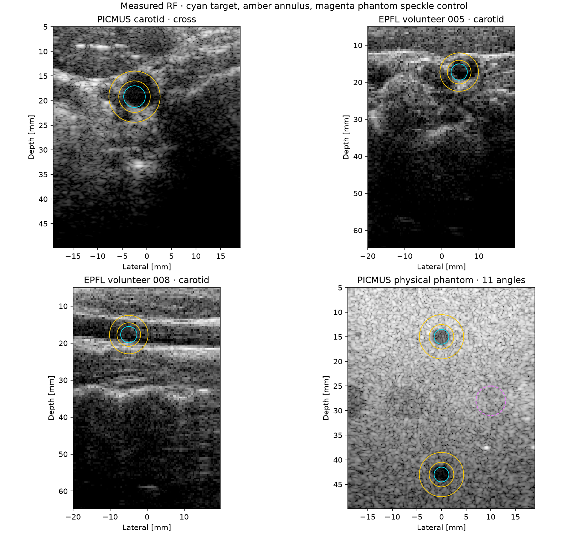
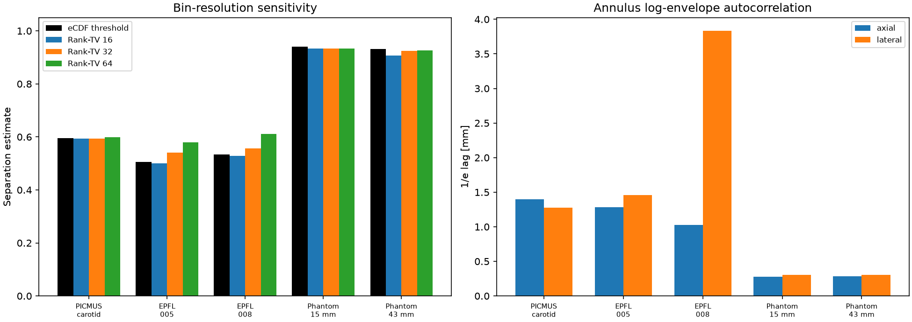

# Measured-RF eCDF and texture transfer diagnostic

Two explicitly distinct EPFL volunteers, a PICMUS cross-section with unspecified subject identity, and one physical phantom acquisition. Human ROI heuristic uses the embedded UFF reference for PICMUS and each EPFL case's own full-angle image. Phantom cyst ROIs are fixed nominal geometry. These are previously inspected acquisitions, not blinded prospective validation.

Raw rank-bin sign changes and total-variation gaps vary with bins, finite samples and spatial dependence: they cannot verify a population density crossing count. The sample-count-matched Rayleigh control is IID and not a model fit or hypothesis test. Annulus texture is not homogeneous or stationary by assumption; 1/e decorrelation is descriptive, not an independent-sample count or a bootstrap block-size recommendation. No clinical or 95% coverage claim.

| Acquisition / ROI | eCDF threshold | 64-bin gCNR | Rank-TV 16/32/64 | Sign changes 16/32/64 | Axial 1/e mm | Lateral 1/e mm |
|---|---:|---:|---|---|---:|---:|
| picmus_cross / PICMUS carotid · cross | 0.596 | 0.546 | 0.593/0.593/0.598 | 1/1/3 | 1.397 | 1.276 |
| epfl_v5 / EPFL volunteer 005 · carotid | 0.506 | 0.502 | 0.500/0.540/0.580 | 1/7/15 | 1.285 | 1.455 |
| epfl_v8 / EPFL volunteer 008 · carotid | 0.534 | 0.516 | 0.528/0.557/0.611 | 1/7/13 | 1.024 | 3.833 |
| picmus_contrast_phantom / shallow_cyst | 0.940 | 0.928 | 0.933/0.933/0.933 | 1/1/1 | 0.275 | 0.302 |
| picmus_contrast_phantom / deep_cyst | 0.931 | 0.926 | 0.908/0.925/0.926 | 1/1/1 | 0.284 | 0.308 |

Sign changes are empirical bin-to-bin density-difference signs; they are not a verified population crossing count. Rank-TV is an equal-pooled-rank histogram diagnostic, not a replacement metric. The directional 1/e values come from pair-centered Pearson correlations of log-envelope pairs wholly inside the background annulus; they are not independent sample spacings.

## Finite-sample single-crossing control

For each ROI's pixel counts, 100 new IID Rayleigh pairs with scales 0.5/1.0 and exactly one population density crossing were drawn. These are not fitted tissue models or p-values.

| ROI | Observed 64-bin sign changes | IID one-crossing median [p05, p95] |
|---|---:|---:|
| picmus_cross / PICMUS carotid · cross | 3 | 6 [3, 9] |
| epfl_v5 / EPFL volunteer 005 · carotid | 15 | 15 [11, 22] |
| epfl_v8 / EPFL volunteer 008 · carotid | 13 | 17 [9, 23] |
| picmus_contrast_phantom / shallow_cyst | 1 | 8 [5, 13] |
| picmus_contrast_phantom / deep_cyst | 1 | 9 [5, 13] |

The separate nominal homogeneous phantom speckle disk at x=10 mm, z=28 mm, radius=3 mm is a texture control. Its axial/lateral 1/e lags are 0.280/0.303 mm.

[Complete settings, provenance and autocorrelation curves](metrics.json)
