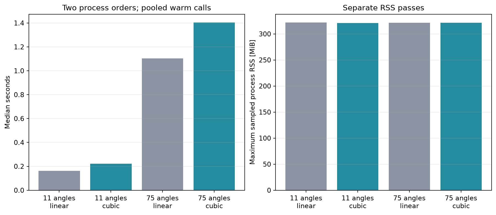

# Linear/cubic reconstruction performance

Two rounds of fresh sequential subprocesses. Round 1 runs 11-linear, 11-cubic, 75-linear, 75-cubic; round 2 reverses this order. Each process loads the same RF, prepares the full analytic cache, excludes one full warmup, times repeated calls without a memory sampler, then samples RSS during a separate additional call. The reported median pools both rounds. No benchmark runs concurrently.

Single host, repeated reconstruction of one loaded acquisition. Preparation, loading, warmup, plotting and serialization are excluded from timings; raw preparation/warmup times remain in JSON. Peak RSS includes cached channels and is a sampled lower bound. OS load, scheduling and CPU power are not controlled. These are reconstruction timings, not acquisition-to-display or sustained cine FPS.

Compare repeat outputs only within the SAME interpolation method and angle count. Linear and cubic deliberately differ; only their coordinates and angle indices must match. Quality evidence lives in the separate transfer and phantom reports.

F/1.7, stride 2, batch 8, cached analytic channels; 8 Numba threads.

| Angles | Method | Median s | Min–max s | FPS | Maximum sampled RSS MiB |
|---:|---|---:|---:|---:|---:|
| 11 | linear | 0.162 | 0.149–0.182 | 6.16 | 321.6 |
| 11 | cubic | 0.223 | 0.199–0.242 | 4.49 | 321.0 |
| 75 | linear | 1.104 | 0.946–1.151 | 0.91 | 321.3 |
| 75 | cubic | 1.403 | 1.338–1.524 | 0.71 | 321.4 |

11 angles: cubic duration changed by +37.2%; sampled peak RSS by -0.6 MiB.

75 angles: cubic duration changed by +27.1%; sampled peak RSS by +0.0 MiB.

All four same-method/angle-count repeat RF/B-mode comparisons passed.

[All durations, process settings, preparation cost and parity errors](metrics.json)
