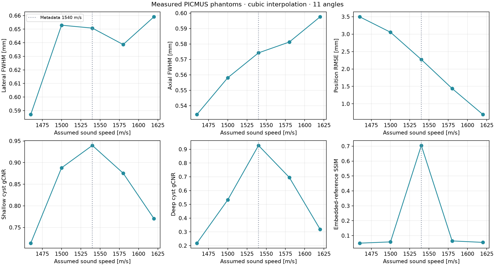

# Delay interpolation and sound-speed sensitivity

Linear uses two adjacent samples. Cubic uses four adjacent samples with the Catmull-Rom cubic convolution formula. Cubic excludes the first/last extra boundary sample required by its support.

Embedded UFF images are same-acquisition algorithmic references, not anatomical ground truth. Nominal phantom target coordinates are approximate. No setting is selected or promoted from this sensitivity study; defaults remain unchanged.

## Linear versus cubic delay interpolation

| Phantom | Angles | Method | Physical measurement | Reference SSIM |
|---|---:|---|---|---:|
| contrast | 11 | linear | shallow/deep gCNR 0.9283 / 0.9262 | 0.8493 |
| contrast | 11 | cubic | shallow/deep gCNR 0.9396 / 0.9275 | 0.8524 |
| contrast | 75 | linear | shallow/deep gCNR 0.9681 / 0.9337 | 0.9338 |
| contrast | 75 | cubic | shallow/deep gCNR 0.9730 / 0.9378 | 0.9329 |
| resolution | 11 | linear | lateral 0.6516 mm; axial 0.5773 mm | 0.7055 |
| resolution | 11 | cubic | lateral 0.6508 mm; axial 0.5742 mm | 0.7049 |
| resolution | 75 | linear | lateral 0.6530 mm; axial 0.5746 mm | 0.7941 |
| resolution | 75 | cubic | lateral 0.6523 mm; axial 0.5724 mm | 0.7923 |

[Contrast images](contrast_interpolation.png) · [Resolution images](resolution_interpolation.png)

## Assumed sound-speed sweep

Cubic interpolation, 11 angles, F/1.7 and stride 2 are fixed.

| Speed m/s | Lateral / axial FWHM mm | Position RMSE mm | Shallow / deep gCNR | Resolution / contrast reference SSIM |
|---:|---:|---:|---:|---:|
| 1460 | 0.5871 / 0.5343 | 3.4964 | 0.7137 / 0.2183 | 0.0497 / 0.0537 |
| 1500 | 0.6529 / 0.5581 | 3.0535 | 0.8878 / 0.5319 | 0.0580 / 0.0712 |
| 1540 | 0.6508 / 0.5742 | 2.2712 | 0.9396 / 0.9275 | 0.7049 / 0.8524 |
| 1580 | 0.6387 / 0.5813 | 1.4391 | 0.8755 / 0.6956 | 0.0645 / 0.0705 |
| 1620 | 0.6591 / 0.5976 | 0.6933 | 0.7705 / 0.3190 | 0.0548 / 0.0581 |

[Full per-target, cyst, timing, cache and provenance records](metrics.json)
