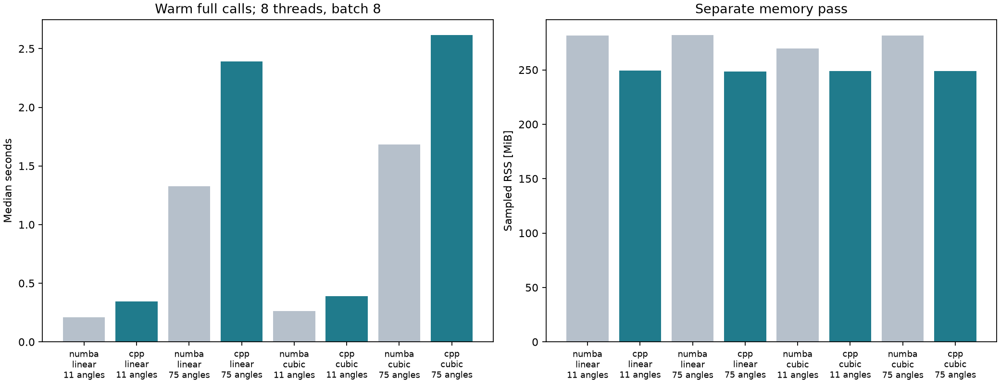

# C++ analytic focusing: verification and matched profile

Fresh subprocess per backend/interpolation/count, run sequentially. One full warmup excluded, then five timed full calls by default. Includes channel validation/selection, Hilbert quadrature, double conversion for C++, focusing and log compression; data load excluded. Eight Numba/OpenMP threads requested; C++ falls back to serial without OpenMP. Separate additional call samples process RSS every requested 2 ms; sampled lower bound, not allocation size. Warmup and retained allocator buffers affect baseline. No analytic cache. C++ focuses both components; preprocessing remains Python/SciPy. Not a fully native pipeline, live integration, GPU result, or universal speedup claim. Fixed process order is not counterbalanced; thermal/scheduler effects remain possible.

| Interpolation | Angles | Backend | Median s | Sampled RSS MiB |
|---|---:|---|---:|---:|
| linear | 11 | numba | 0.2113 | 281.6 |
| linear | 11 | cpp | 0.3455 | 249.2 |
| linear | 75 | numba | 1.3257 | 282.0 |
| linear | 75 | cpp | 2.3925 | 248.6 |
| cubic | 11 | numba | 0.2640 | 269.6 |
| cubic | 11 | cpp | 0.3910 | 248.7 |
| cubic | 75 | numba | 1.6828 | 281.6 |
| cubic | 75 | cpp | 2.6160 | 248.8 |

C++/Numba full-array equivalence: all four configurations passed.
C++/NumPy: both 11-angle methods and SWE frames 0/middle/last passed.
RF rtol=1e-5, atol=1e-7; B-mode atol=1e-4 dB; numerical, not clinical equivalence.

[Raw evidence](metrics.json)
