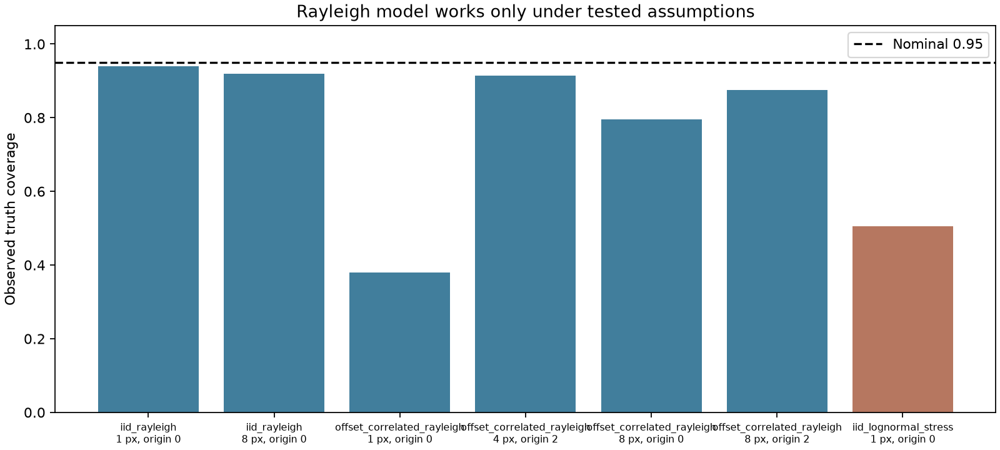

# Rayleigh-model gCNR coverage stress test

Synthetic envelopes, not RF or patient data. Rayleigh MLE scales and exact two-Rayleigh density overlap; fixed ROI. Pixel IID, offset 4x4 constant tiles, and misspecified IID lognormal stress. Block origins 0 and 2 were fixed from the generator geometry, never selected from results. Independent random fields across scenarios; same field across block options. Percentile resampling treats occupied 1x1, 4x4 or 8x8 tiles as units and preserves partial ROI masks.

A Rayleigh model is not established for human tissue, adaptive beamformers or all phantoms. Better coverage on its generating model cannot validate intervals for measured RF. Aligned blocks require knowledge of correlation geometry; this experiment does not estimate it. Lognormal stress uses a known non-Rayleigh population and deliberately tests model failure. Finite Monte Carlo uncertainty is summarized by Wilson intervals; no calibration on these evaluation trials, no automatic replacement of the 64-bin metric.

200 independent fields/scenario; 300 resamples/interval.
Rayleigh truth: 0.472470; lognormal truth: 0.379474.
Source: [Schlunk & Byram (2023)](https://lab.vanderbilt.edu/beamlab/wp-content/uploads/sites/191/2024/04/schlunk_2023_gcnr.pdf).

| Scenario | Block | Origin | Coverage | Wilson 95% | Bias | Width |
|---|---:|---:|---:|---|---:|---:|
| iid_rayleigh | 1 | 0 | 0.940 | [0.898, 0.965] | -0.0017 | 0.0888 |
| iid_rayleigh | 8 | 0 | 0.920 | [0.874, 0.950] | -0.0017 | 0.0906 |
| offset_correlated_rayleigh | 1 | 0 | 0.380 | [0.316, 0.449] | -0.0061 | 0.0822 |
| offset_correlated_rayleigh | 4 | 2 | 0.915 | [0.868, 0.946] | -0.0061 | 0.3007 |
| offset_correlated_rayleigh | 8 | 0 | 0.795 | [0.734, 0.845] | -0.0061 | 0.2381 |
| offset_correlated_rayleigh | 8 | 2 | 0.875 | [0.822, 0.914] | -0.0061 | 0.3010 |
| iid_lognormal_stress | 1 | 0 | 0.505 | [0.436, 0.574] | +0.0907 | 0.1913 |

This is a conditional model diagnostic, not a general solution for measured ultrasound or calibrated clinical intervals.

[All independent trials](metrics.json)
