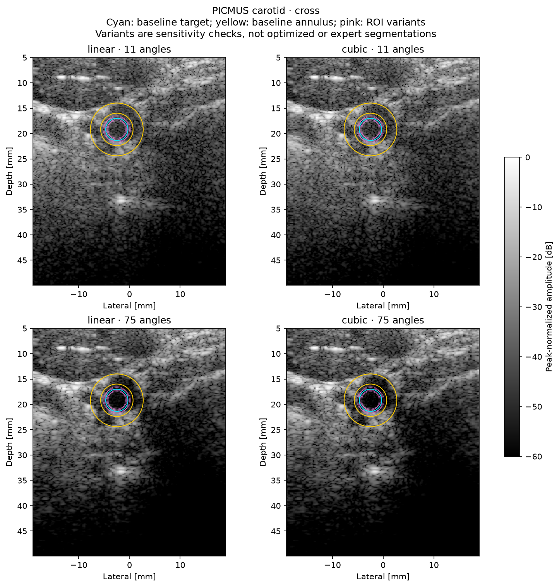
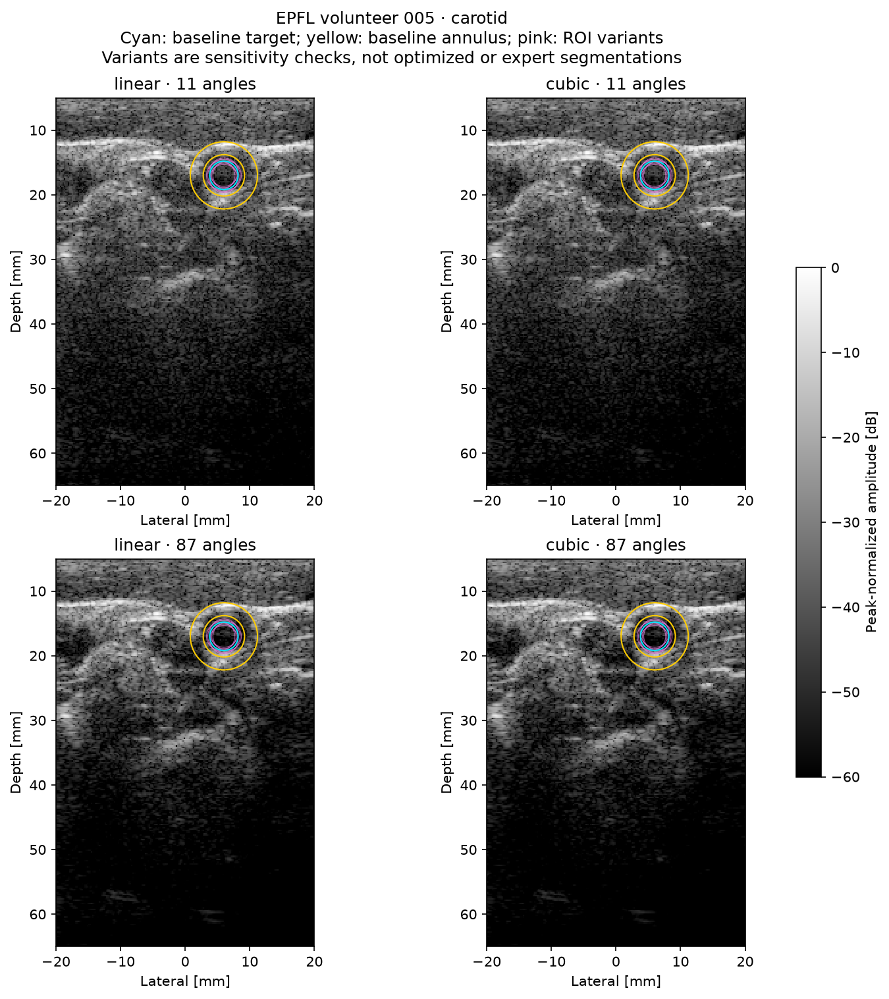

# Human ROI and block-origin sensitivity

Two previously inspected human acquisitions, not a new blinded clinical cohort. PICMUS ROI is selected once from the embedded reference. EPFL volunteer 005 ROI is manually frozen at x=6 mm, z=17 mm, radius=2.2 mm after viewing the previous full-angle linear image, before this study's metrics. EPFL has no independent image reference or expert segmentation; selection bias remains. PICMUS subject identity is unavailable; no assumption of participant independence.

Ten one-factor-at-a-time conditions per acquisition: baseline; four ±0.5 mm center shifts; two ±0.3 mm radius changes; three half-block origin shifts. Annulus radii remain target radius +1/+3 mm. No optimum is selected. Each condition freezes the same masks and paired tile draws for linear/cubic at 11/full angles. Same pixel-sized blocks have different physical dimensions across grids; physical sizes and counts are reported, not pooled.

Sensitivity ranges are not confidence intervals and do not incorporate ROI uncertainty into the bootstrap intervals. No factorial ROI/origin interactions, coverage calibration, histogram-bin sensitivity, observer or population inference. Resampling retains only within-block dependence; finite heterogeneous masks and manual/algorithmic region selection limit interpretation. Defaults stay unchanged.

| Case | Cubic − linear | Baseline ΔgCNR | ROI perturbation min–max | Point sign changes? | Origin intervals including zero |
|---|---|---:|---|---|---|
| picmus_cross | cubic_11 − linear_11 | +0.0085 | [-0.0006, +0.0121] | True | 4/4 |
| picmus_cross | cubic_75 − linear_75 | -0.0019 | [-0.0048, +0.0019] | True | 4/4 |
| epfl_v5 | cubic_11 − linear_11 | -0.0047 | [-0.0131, -0.0028] | False | 4/4 |
| epfl_v5 | cubic_87 − linear_87 | -0.0056 | [-0.0098, +0.0034] | True | 4/4 |

The min–max column spans seven fixed ROI choices, not a confidence interval.
Origin tests change only tile partitioning: point estimates and pixel masks
must remain unchanged. See JSON for all contrast/CNR/gCNR intervals, paired
deltas, physical block sizes, geometry, source/settings hashes and rejected draws.

[Full numerical evidence](metrics.json)
