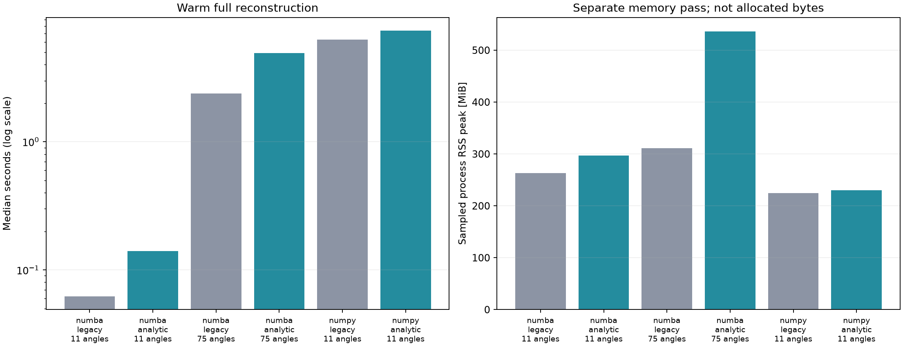

# Analytic runtime and memory profile

One fresh subprocess per backend/mode/angle combination, executed sequentially. Load data, run one full warmup, then time repeated full reconstruction calls. RSS sampling occurs only during a separate extra call, not the timed calls. Calls include channel selection, Hilbert (when used), beamforming and compression. File loading, plots, serialization and full warmup are excluded. Warmup may include JIT/cache loading; it is not a pure compilation-time measurement.

Sampled process RSS is a lower bound on peak working set, not allocated bytes. Baseline includes resident data, interpreter, libraries and retained warmup buffers. Peak-minus-baseline may be small because allocator buffers are reused. Requested 2 ms sampling is not guaranteed by the scheduler. No GPU/native measurements.

Single-host research timing; not real-time or clinical certification. NumPy 75 angles not timed.

| Backend | Mode | Angles | Median s | Min–max s | FPS | RSS baseline / sampled peak MiB |
|---|---|---:|---:|---:|---:|---:|
| numba | legacy | 11 | 0.062 | 0.062–0.063 | 16.09 | 254.8 / 263.1 |
| numba | analytic | 11 | 0.140 | 0.139–0.334 | 7.13 | 255.6 / 296.9 |
| numba | legacy | 75 | 2.378 | 2.241–2.388 | 0.42 | 254.5 / 310.8 |
| numba | analytic | 75 | 4.934 | 4.715–5.050 | 0.20 | 255.0 / 536.3 |
| numpy | legacy | 11 | 6.280 | 6.066–6.416 | 0.16 | 220.4 / 224.5 |
| numpy | analytic | 11 | 7.356 | 7.028–7.571 | 0.14 | 223.1 / 229.9 |

Full-array NumPy/Numba numerical agreement passed at 11 angles for both modes.

[Raw repeats, host, settings, checksums and agreement errors](metrics.json)
