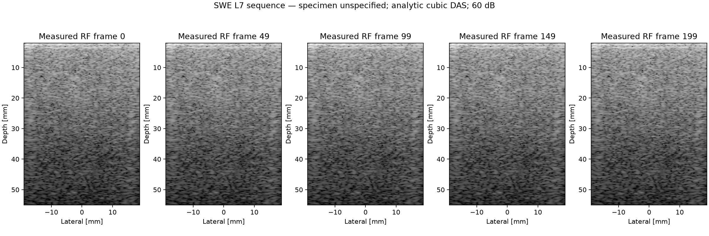
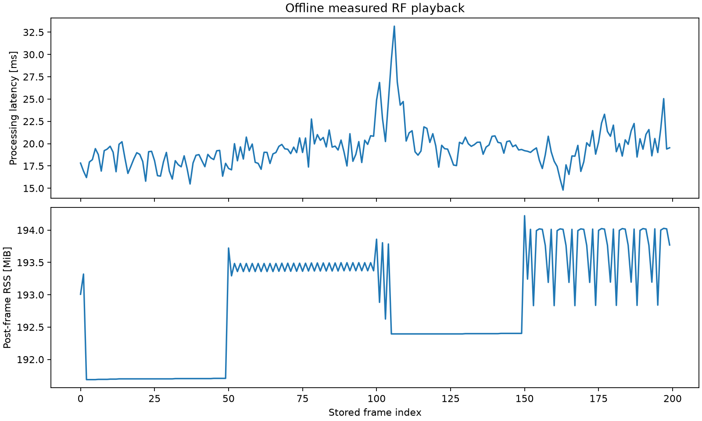

# Measured RF sequence playback

Sequential offline file playback, not live device ingestion. One RF frame at a time; no queue, no cross-frame analytic cache. Warmup excluded. Timings include HDF5 read, finite-value validation, per-frame Hilbert, focusing and compression. NumPy verification is a separate pass; retaining five previews is untimed; processing FPS is sum-of-timed-work throughput, not end-to-end wall throughput. RSS sampled after each frame (not transient peak); includes retained previews and allocator buffers. Storage cache state is uncontrolled. No frame period is given by the file; no deadlines, sustained device throughput or clinical claims.

Source: [USTB archive](https://zenodo.org/records/20261898); specimen unspecified (not claimed patient data).
SHA256: `21956c2dcb75d8d907418dd5f2144156b363f259b24fed9fb8fcba7d5fa1035b`.

- 200 stored RF frames; input [200, 1, 128, 1664].
- [256, 128] pixels, analytic cubic DAS, 8 CPU threads.
- Median 19.29 ms; p95 22.85 ms; maximum 33.17 ms; timed-work throughput 51.27 fps.
- Post-frame RSS maximum 194.22 MiB; last25−first25 mean +1.92 MiB. This does not prove absence of leaks.
- NumPy equivalence passed on frames [0, 100, 199], RF rtol=1e-5/atol=1e-7; B-mode absolute tolerance 1e-4 dB. Numerical agreement is not image-quality ground truth.
- Effective initial time = channel initial time + transmit wave delay, matching USTB DAS.

[All measurements](metrics.json)
