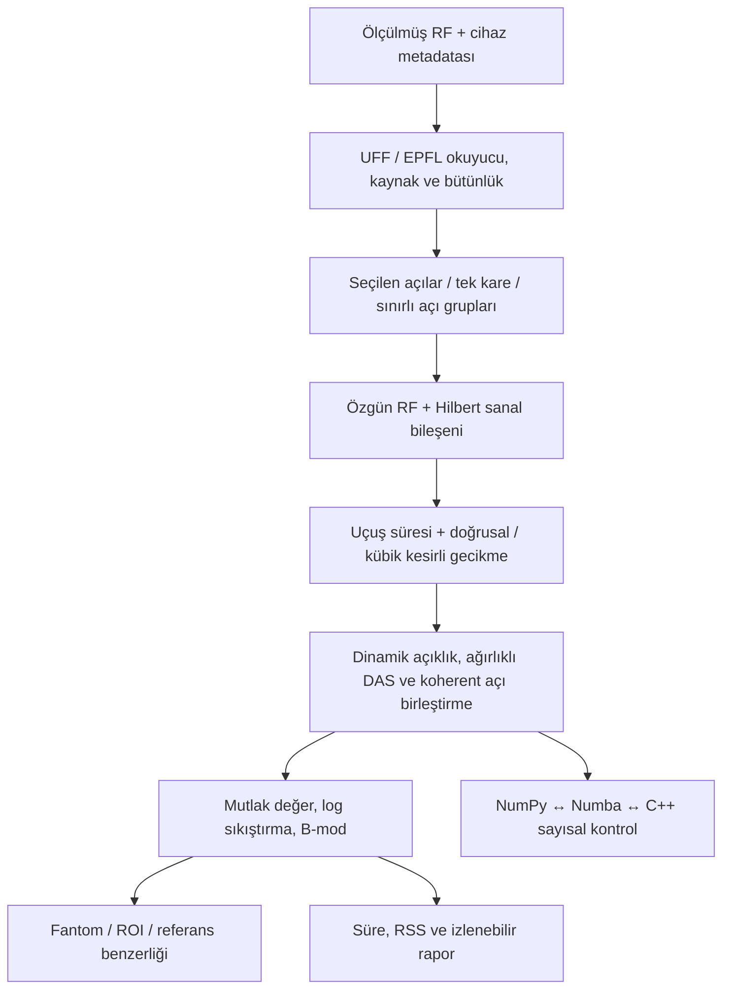

# Ultrasound B-mode Lab — tamamlanan portföy

## Kısa sonuç

İş ilanındaki algoritma geliştirme, dizi sinyal işleme, görüntü kalitesi, hız/bellek
ölçümü ve dokümantasyonu gösteren araştırma portföyü tamamlandı. Son dört iş paketi:
belirsizlik kapsama deneyi, 200 gerçek RF karenin sıralı işlenmesi, C++ aktarım prototipi
ve çevrimdışı demo. Bu, tıbbi cihaz veya klinik doğrulama tamamlandı anlamına gelmez.
Bu dört paket v0.13'te bitti. v0.14–0.16 ek araştırmasında Rayleigh-model
aralıkları, bölmesiz eCDF ve iki ayrı EPFL gönüllüsü ile gerçek RF aktarımı
incelendi. Güncel demo sekiz paneldir; bu ek işler %95 kalibrasyon sağlamadı.

## İki dakikalık anlatım

“Bu çalışmada ultrason cihazlarının ham RF kanal kayıtlarından B-mod görüntü oluşturan,
sonuçları fiziksel fantomlar ve açık insan ölçümleriyle inceleyen bir araştırma yazılımı
geliştirdim. Hazır ekran görüntülerini iyileştirmek yerine, gönderim açıları, prob eleman
konumları, örnekleme frekansı ve uçuş sürelerinden görüntüyü yeniden oluşturdum.

İlk önemli problem, kaba görüntü ızgarasında yapılan zarf algılamanın çizgilenmeye yol
açmasıydı. Hilbert işlemini özgün kanal zaman eksenine taşıyarak analitik RF kullandım.
Ardından F-sayısı, doğrusal/kübik enterpolasyon, açı sayısı ve ses hızı değişimlerinin
kontrast, gCNR ve eksenel/yatay çözünürlük üzerindeki etkilerini ölçtüm. Bir ölçütün
iyileşmesinin diğerlerinin de iyileştiği anlamına gelmediğini raporladım.

Numba ile hızlandırdım; açı gruplama ve aynı kayıtta tekrar kullanım için önbelleği
inceledim. 200 kareli ayrı bir cihaz dizisinde, tek karelik okuma yaklaşımıyla süre
ve bellek davranışını ölçtüm. C++17/OpenMP odaklama prototipini derleyip NumPy/Numba
ile tolerans içinde uyuştuğunu doğruladım. Bu sürüm daha hızlı olmadığı için hız
üstünlüğü iddia etmiyorum.

Son olarak belirsizlik hesabını gerçek değeri bilinen sentetik zarflarla sınadım.
Mevcut gCNR aralıklarının kalibre olmadığını gördüm. Ardından Rayleigh-model ve
bölmesiz eCDF adaylarını bağımsız sentetik alanlarda denedim. Gerçek cihaz
fantomu ile iki ayrı EPFL gönüllüsünde ölçümleri aktardım; insan ROI'lerindeki
uzamsal bağıntı ve sonlu örneklem nedeniyle tek-eşik varsayımını veya geçerli
%95 aralığı doğrulayamadım. Bunları açıkça dokümante ettim. Amaç yalnızca
güzel görüntü üretmek değil; değişikliklerin neyi, hangi bedelle iyileştirdiğini ve
hangi iddiaların verilerle desteklenmediğini göstermekti.”

Bu bir anlatım taslağıdır. Kod ve belge geliştirme AI destekli yürütüldü. Kendi katkını
ve açıklayabildiğin bölümleri dürüstçe anlat; yapmadığın klinik çalışma, cihaz entegrasyonu
veya donanım geliştirmesini kişisel deneyim olarak sunma.

## Mimari

Kartezyen düzlem-dalga görüntü ızgarası kullanılır; sektör tarama dönüşümü ve cihaz
görüntüleme arayüzü kapsam dışıdır. Analitik RF, taban banda indirilmiş IQ değildir.
C++ yalnızca odaklama döngüsünü çalıştırır.

## Son dört adımın kanıtları

| İş paketi | Sonuç | Kanıt |
|---|---|---|
| Belirsizlik | Senaryo başına 200 alan, 300 bootstrap çekilişi. IID gCNR kapsaması %65,5–70; bağıntılı modelde %0. Kalibrasyon başarısı yok. | [Kapsama deneyi](../artifacts/coverage/README.md) |
| Ardışık RF | 200 cihaz karesi, 256×128 analitik kübik DAS; ortanca 19,29 ms, p95 22,85 ms. Dosyadan işleme, canlı cihaz değil. | [Kare deneyi](../artifacts/sequence/README.md) |
| C++ aktarımı | Float32/64, doğrusal/kübik, analitik/gerçek RF, eksik son açı grubu. Ölçülmüş veride 9 eşdeğerlik kontrolü. Numba daha hızlı. | [Native raporu](../artifacts/native_profile/README.md) |
| Sunum | Gereksinim/test/risk belgeleri, mülakat metni ve güncel sekiz panelli çevrimdışı demo. | [Demo](../artifacts/portfolio/README.md) |

## Bitiş çizgisinden sonraki araştırma

| Sürüm | Soru | Ölçümün dürüst sonucu |
|---|---|---|
| v0.14 | Rayleigh-model gCNR aralığı genellenir mi? | Hayır. Son bağımsız kontrolde IID %96, hizalı bağıntılı %89, lognormal %45 kapsama. |
| v0.15 | Histogram bölmelerinden bağımsız eCDF yardım eder mi? | Bağıntılı sentetik alanlarda nokta yanlılığı düştü; bağıntı-farkındalıklı muhafazakâr aralık `[0,1]` ve yararsız. |
| v0.16 | Gerçek RF'de tek-eşik ve uzamsal bağıntı anlaşılır mı? | İki ayrı EPFL gönüllüsünde ince bölmeler çok işaret değişimi verdi; tek-kesişimli sentetik kontrol de benzer değişimler verdi. Fantom speckle kontrolü yaklaşık 0,28/0,30 mm; insan halkaları heterojen. |

Bu satırlar yeni klinik veya istatistiksel başarı iddiası değil, aday yöntemin
ne kadarını savunabildiğimizi gösteren sınır kayıtlarıdır.
Demo paketindeki [manifest](../artifacts/portfolio/manifest.json), girdi
kanıtlarının ve HTML'nin taşınabilir SHA-256 özetlerini tutar. Depoda
`python scripts/build_portfolio.py --verify` ile doğrulanır.

## Üç dakikalık demo akışı

1. `artifacts/portfolio/index.html` dosyasını tarayıcıda aç. Bu önceden hesaplanmış bir
   kanıt görüntüleyicisidir; tarayıcıda RF hesaplaması yapmaz.
2. “İnsan RF verisi”: aynı ham kayıtta eski/analitik yol ve UFF referansını karşılaştır.
   Referans benzerliğinin anatomik doğruluk olmadığını belirt.
3. “Fiziksel fantom”: kontrast/çözünürlük ödünleşimini anlat; kübik her durumda üstün değil.
4. “Belirsizlik sınırı”: olumsuz sonucu ve kalibre olmayan aralıkları açıkla.
5. “Bölmesiz eCDF deneyi”: nokta yanlılığındaki kazancı ve `[0,1]` aralığının
   neden kullanışsız olduğunu birlikte göster.
6. “Gerçek RF aktarımı”: iki ayrı EPFL gönüllüsünü ve fantom kontrolünü göster;
   işaret değişimlerini nüfus dağılımı kanıtı sayma.
7. “200 RF kare” ve “Süre / bellek”: dosya oynatma ile canlı entegrasyonu ayır.
8. “C++ aktarımı”: sayısal eşdeğerliği, derlemeyi ve ölçülen hız sınırını göster.

## İlandaki beklentilerle ilişki

| Yetkinlik | Somut örnek |
|---|---|
| Örnekleme, Fourier/Hilbert, filtreleme | Kanal zaman ekseni / çıktı ızgarası ayrımı; sinüs ve zarf testleri |
| Dizi işleme ve beamforming | DAS, CF, PCF, DMAS, MVDR; fiziksel açı seçimi, dinamik açıklık |
| Python geliştirme | Küçük işlevler, CLI araçları, tekrarlanabilir raporlar ve CI |
| Görüntü kalitesi | gCNR/CNR, kontrast, FWHM, SSIM/RMSE; ROI ve ses hızı duyarlılığı |
| Platformlara aktarım hazırlığı | Numba / C++ prototipi, açı gruplama, tek kare okuma ve maliyet ölçümü |
| Dokümantasyon | Gereksinim → test → kanıt; risk kaydı ve veri kökeni |

## Kapsam dışında kalanlar

- Canlı cihaz bağlantısı, FPGA/GPU üzerinde doğrulanmış çalışma, teslim süresi garantisi.
- Kalibre edilmiş gCNR güven aralığı veya hasta/toplum düzeyinde istatistiksel çıkarım.
- Klinik tanı başarısı, hekim değerlendirmesi, akustik çıkış kontrolü, DICOM ve IEC/ISO uygunluğu.
- Dört insan kaydı dört bağımsız hasta değildir. SWE dizisinin örnek türü ve edinim
  kare hızı bilinmeyen olarak tutuldu.

Bunlar ayrı Ar-Ge/ürünleştirme kapsamlarıdır; mevcut yazılımın sağladığı özellikler değildir.
